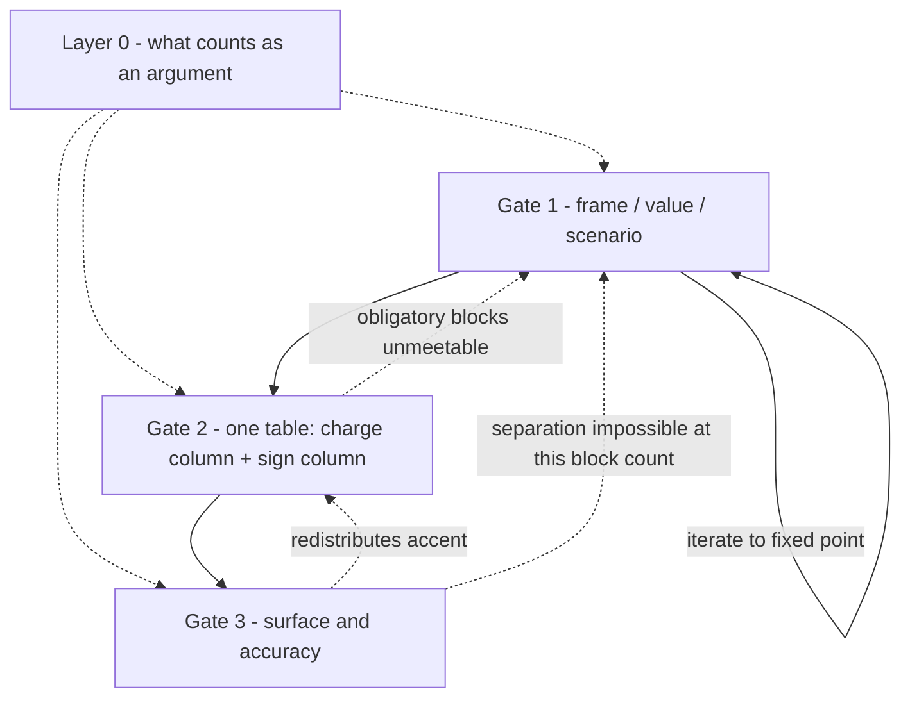

# design-derivation

## 1. What this is and where it came from

This skill encodes one reconstructed reasoning model, not a body of design knowledge. It was reconstructed from roughly 134 hours of publicly published Russian-language lectures and live design-critique streams by a single author (YouTube channel "Эрзац" / "Дазайн", @ersatzdasein), then put through an adversarial verification pass against a corpus of 63 transcripts. It was assembled without his involvement. He has not reviewed it, endorsed it, or authorised it; it is not official and not a distillation he sanctioned. The verification cut it substantially: fewer than four in ten of the extracted moves survived unchanged, roughly a quarter rest on a single occurrence and are quarantined in `references/limits.md`, and several were removed as inverted or absent from the corpus. The gate order below is the corrected dependency skeleton that verification reconstructed — a priority order, not an observed protocol; in live critique the author enters from any side. Where this skill and the author disagree, the author is not bound by this skill.

Before you assert any number, any rule, or any attribution taken from this model, load `references/limits.md`.

## 2. What this skill refuses to be

This skill refuses to be a style guide. It contains no named styles, no palettes, no typeface recommendations, no reference aesthetics, no component recipes — and no blacklist of looks to avoid, because prohibiting specific looks narrows the reachable space instead of widening it, and that narrowing is the failure this skill exists to prevent. It also refuses to be a list of practices: nothing here is an answer that can be carried from one brief to the next. Every operation it names is unsigned until a ledger line signs it — the same act is a gain at one reading and a loss at another — and every number it prints is an instance of a derivation you must redo. If you find yourself reaching for a reference aesthetic, a default spacing scale, or a solution you remember working, that is not this skill operating; it is the signal that a gate was skipped.

## 3. The one rule: entry is free, commitment is gated

Look anywhere first, including straight at the surface, including at the thing that annoys you. Fix nothing until the gate above it has a named answer written in the Ledger.

This is honest because it matches what the corpus shows: in the overwhelming majority of live critiques the author enters from whatever first catches the eye and reconstructs the frame afterwards. Only two moves chronologically precede drawing — lay out the bare logos, and do not liberalise a spec where an implicit design system may be hidden. So retroactive frame-building is legal here. It is simply required to be written down instead of held silently.

**Hard stop.** Emit no colour value, no spacing number, no type size, no shape decision, and no markup until Ledger slots 1–5 have entries. If you have already typed one, delete it; a value emitted before slot 5 is a remembered look wearing a derivation's clothes.

**Size router.** Ask what the change can reach. If it cannot alter group membership, contour assignment, or the accent palette, it is an accuracy-account edit: say the word *accuracy* out loud, put it on the atemporal account, go straight to Gate 3, write no Ledger, and do not dress it as speed or convenience. If it can alter any of the three, every gate applies, however small the request looked.

The router pays the same admissibility price as a Ledger line, because it is the documented way past the hard stop above. Taking it costs **one written line**: which of the three the change cannot reach, and the observation that would show that wrong — e.g. *"cannot reach the accent palette: this block sits in the second contour and is charged against no first-contour neighbour; falsified if the edit moves its contour assignment."* No line, no exit.

**Standing rule:** if the router is invoked twice on one segment, the second invocation is void and the full gate runs. Repeated accuracy routing on a single segment is the signature of a structural problem being paid down in small change.

**Discard rule.** A Ledger written to justify a drawing that already exists is layout hermeneutics. Discard it and re-derive from the brief. Never edit a Ledger line into agreement with a picture.

## 4. The Derivation Ledger

Copy this block, one per segment, and fill every slot. One line each, twenty words maximum. The *type* of each slot is the anti-generic device: a slot filled with a category instead of its type has not been filled.

```
LEDGER — <segment>
1 TEMPORAL READING      score of how hard this segment instrumentalises time, either direction (acceleration OR deliberate dwelling) + the argument its elements are defended by
2 ATEMPORAL + CARRIER   score of how much affect this must carry + a proper noun naming who already carries it, or the word "nobody"
3 TOPICAL POSITION      scenario / balance / block — solution in the linking of orderings, or inside one carrier — + one clause of why
4 CARRIER               what counts as a block here; what the block ordering is; how many renewal events, and where; is advance live
5 VALUE + OBLIGATORY    who came here for what + an integer: how many blocks the scenario actually makes obligatory
6 ADVANCE               entry point (cold traffic / return / deep link) + ON or OFF — OFF under absolute temporality, and say so
7 SIGN BUDGET           the named audience, how many interpretants it reads unambiguously, which slot takes high sign-load and which takes low
8 REQUIRED SPAN         a computed value, derived from slot 5 and from block function — never read off taste

FLIP      the one Ledger line whose change would invert this answer
SEGMENTS  the segments this product breaks into + one place where two of them got opposite verdicts (or why there is only one segment)
```

**Admissibility test**, applied to every line. (a) It is a specific noun phrase about *this* brief, not a category. (b) A different brief would produce a different line. (c) It names the observation that would falsify it. A line failing any of the three blocks the gate — it does not degrade it, it stops it.

## 5. The map



This is a loop-and-column structure, not a waterfall. Rendering it as a numbered list would misstate the model.

## 6. Layer 0: what counts as an argument

Standing filter, always active. On a fresh brief it produces no written output. It produces one written line every time a claim is made, defended, or received — yours, the client's, a critic's, and most of all someone else's.

- **Time claim** → name the measurement artefact (time on task, step count, usability report, eye-tracker) or do not make the claim.
- **Black box** → "a big company does it", "users are used to it", "it's convenient", "it was signed off" are not arguments. Ask for the derivation.
- **Soft word** → operationalise it into something that changes a decision, or drop it as a reified word.
- **Metric** → legitimate as the source of a task and as a target, illegitimate as the closing argument. When struck with one, ask for attribution (what else changed) and provenance (who, how, on what sample).
- **Analogy** → a source of hypotheses, never a link in a derivation. Extending a concept obliges you to name the class where it stops working.
- **Post-hoc** → ask whether a model produced the form, or the description was fitted to the form afterwards.
- **Currency** → the reading decides which defence is admissible for each element; a defence paid in the wrong currency is void even when it sounds right. On a foreign term used inside its own field, the correct verdict is usually "not applicable here", not "empty word".

Verdict discipline: name the value and what *ought* to be; read what *is* off the form with the content ignored; state the verdict only as the divergence between them; attach content last, as a modifier of charge. Full protocol and the defence of a decision to a stakeholder: `references/argument.md`.

## 7. Gate 1: frame ⇄ value ⇄ scenario

This is a loop, not a step. The modus sets how a block is read, while temporality is derived from the specific segment's scenario — neither is prior. **Exit when the frame stops rewriting the scenario reading and the scenario stops rewriting the frame.**

**The two independent readings (slots 1–2).** Score them in parallel on the same work; they may diverge, and a weak temporal reading alongside a strong atemporal one is a finding, not an error. Pole A is instrumentalisation of time in *either* direction — deliberate dwelling counts. Four tests: what is each element defended by, an argument from time or an argument from affect; a time claim owes a measurement artefact; who already carries the affect — if a carrier exists (the world, the covers, the food, the content), the interface adds none **of its own**, which is a routing answer and not a verdict of neutrality: what it may still do is propagate that carrier's sign through the layout as one system, and what it may not do is manufacture a second affect against it; and the inverted test — ask whether *acceleration* would break the atemporal, not whether slowing down would hurt.

Both scales, their operational tests, and the verification standing that decides whether a claim may be made on them at all: `references/axes.md`. That file also carries the cross-brief check this skill's output contract requires.

Keep separate from all of this: the three-position matrix (temporal / balance / atemporal × scenario / balance / block) types a **designer and a task**, not a work. A mismatch between a task's cell and a designer's habitual vector is a diagnosis about the designer. Do not use it to read a layout.

**Topical position (slot 3).** Is the solution in the linking of block orderings, or inside one carrier? This answer decides what Gate 2's block ordering even is.

**Carrier (slot 4).** Answer the four questions: what counts as a block here; what the block ordering is; how many renewal events exist and where they sit; is advance live. The moment the carrier is not a plain screen — banner, mark, print, HUD — load `references/carriers.md` before fixing the ordering.

**Value (slot 5).** Who came here for what; imperative or voluntary; contact frequency; the physical constraint hiding behind a number in the brief; then value → functionality → block ordering. Strip the work to bare logos before you draw anything.

**Scenario work.** Mark segments temporal or atemporal, and require a short exit from any atemporal stretch. Distribute contours 1/2/3 by degree of importance of the information. Count steps to value. Place friction only immediately before the point where the user is already up against value. Run the instant-delivery experiment: hand the result over at once, then name exactly what the user loses.

**Advance (slot 6).** A second reading walked over the same block ordering, joint by joint: at each seam, does this block add credit or burn it? It must add more than it spends. Calibrate by entry point — cold traffic starts near zero, a return visit starts high. Under absolute temporality (the user has already decided; there will be no drop) the question switches OFF; write that it is off. Depth: `references/frame.md`.

**Compute the INAPPLICABLE line before leaving this gate.** It is derived from slot 4, not composed. Walk the preconditions and print every law this carrier fails: no renewal events voids the renewal law, the loop diagnosis, and every argument in which a cost accrues per pass; no next step the user may decline, or absolute temporality, voids advance; no named audience voids every sign verdict; a carrier outside the demarcation — anything not drawn as a layout or graphic and consumed by the eye in a frame — voids all of it. If nothing fails, say so and name the property you checked. Procedure and the full precondition table: `references/carriers.md`.

## 8. Gate 2: charge and sign, one pass, two columns

**Nothing in this skill is a signed practice.** Proliferating entities, slowing the passage, stylising, duplicating, dividing, iconifying, adding a plot object — all unsigned operations. The Ledger signs them. The same act is a gain at one reading and a loss at another. Never recall a sign; derive it.

Build one table. One row per block, both value columns filled in the same pass.

```
| block | charge (absolute) | sign-load: interpretants read unambiguously / response given |
```

**Enumerate blocks.** Anything visually separated is a block. Outlines and rules are blocks in their own right. A row of similar items collapses into one unit of comparison — and check that you have not split points that were already equal.

**Order them.** The block ordering is arbitrary to take and is simultaneously the actual chain of actualisation, parameterised by hierarchy, which sets transition probability. Contour decides membership: second-contour elements sit on a different ordering.

**Charge column.** Score absolutely on a 1–10 range (illustration — a working range, not a norm), never as a share of a hundred. The frame's budget is closed *between* cognitive acts and resets after one; it does not conserve across acts. Measure the span between extremes and the depth of the accent pits, not brightness. Collapse adjacent equals. Reach the required span with the fewest operations. Name accent #1 — the thing the product exists for; every other element is a claimant taking from it.

**Derive the required span (slot 8)** instead of assuming that high is good. Few scenario-obligatory blocks (the corpus's working threshold sits around five to seven — illustration, not a norm) → a wide span is mandatory and "complex product" is not a defence. Objectively many blocks → attack the *number* of blocks (contest it, push to the second contour, collapse into a row), not the contrast. A block that is a choice among equivalents is *correctly* flat, and the work there is separation of equals, not accent. Check the inverse error every time: the span may be fine and the accent on the wrong block.

**Renewal law, as time-indexing.** List this artefact's hard cognitive acts — a click, a scroll, reading a paragraph, filling a field. Hover is not one; looking is not one; a cliché icon does not count as one. Re-read the charge column after each act. Motion never exhausts.

**Sign column.** For this named audience: how many interpretants are read unambiguously, and what affective response they give. Orthogonal to charge and to detail; sign-load plus detail is plot-load. Assign slots under the sufficiency principle — high sign-load into the plot object, low sign-load deliberately onto the background. Low sign-load is a legitimate strategy; it is defective only when it occupies the plot slot to fill emptiness. If there are more signs than the hierarchy allows, find a carrier outside the row of blocks.

**Exit condition, covering both columns.** The charge column reaches the required span, and every sign slot has a named strategy — at both scales of judgement, screen and block. Expect the two verdicts to differ; neither overrides by default, and the block's function in the scenario resolves them.

Building a curve out of these numbers is optional and never required. Do not build one, and never demand one from the user; the author himself does not build one in a live critique. Depth: `references/charges.md`, `references/sign.md`, `references/operations.md`. When something reads as wrong and you have an impression rather than a mechanism, the failure catalogue is `references/anti-patterns.md` — every entry there carries the reading that makes the act a failure and the conditions under which the same act is correct, and an entry cited without its governing Ledger line is fake method.

## 9. Gate 3: surface and accuracy

Four ordered tests for any extra layer — substrate, divider, frame, fill. Stop at the first that fires. (1) Does it add information? (2) Does it have its own exclusivity? (3) Does the spacing fall out of the progression? (4) Does the composition fail to hold without it? Two prohibitions: a layer must not duplicate a separation that already exists, and a legal layer must not be so weak that removing it changes nothing. Never argue "fewer densities, therefore faster" — that is the model's own name for fake method.

**Spacing** is a progression along letter → space → line → paragraph → block. Break it only on one of three named grounds: (1) there is nothing on the far side (a screen edge); (2) the separation is already carried by a non-spatial means — this ground rests on a single conversation with a guest, so name it as the weakest of the three when you use it; or (3) the break actually split two concrete groups harder than the progression could. A fourth ground is invention. Count by eye, not by ruler.

**Before a substrate, build the future**: how many more of these will follow. **Two levels of card nesting is the confirmed limit**; for substrates and other layer types, treat two as the working ceiling by analogy and say that the extension is this skill's and not the corpus's. Past the ceiling the eye stops distinguishing steps, and the separation must move to another instrument rather than adding a layer. Count the visual rules in play — their number is the felt desynchronisation.

**The accuracy account.** If the fix changes group membership, or lets data merge into a foreign group, it is critical: fix it and argue it through time. If it does not, name it accuracy out loud, put it on the atemporal account, and stop dressing it as speed.

**Backflow is mandatory.** Any decision here that redistributes accent re-opens Gate 2, and the affected Ledger line is rewritten wholesale. Depth: `references/surface.md`.

## 10. The reading is local: recompute triggers

The Ledger is re-read per segment, per screen, per contour. One product legitimately carries several readings, and that is where its internal variety comes from — not from a style choice. Never carry one global reading through a whole product. Re-run the gates when:

- the entry point changes;
- an affect carrier appears or leaves;
- the count of obligatory blocks moves;
- the audience widens or narrows;
- a segment boundary is crossed — a hot repeated path inside an otherwise atemporal product, or an atemporal moment inside an imperative one;
- the carrier changes;
- a second, unlisted scenario surfaces.

## 11. Re-opening a gate, and gates you cannot answer

Three backflow edges: Gate 3 → Gate 2 when a layout decision redistributes accent; Gate 2 → Gate 1 when the obligatory block count cannot be met; Gate 3 → Gate 1 when separation is impossible at this block count. A re-opened gate is rewritten wholesale — a patched Ledger is how a derivation quietly becomes a rationalisation.

If a gate cannot be answered, say so. Either ask the user, or mark the line a hypothesis and name the observation that would settle it. Never proceed silently past an unanswered slot. When several candidates are equally good for second place, mark them as hypotheses; do not resolve them by taste.

## 12. Numbers

Every number here is an instance of a derivation to redo, never a value to copy. No number may be emitted without its status attached inline at the point of use: *illustration*, *norm with bounds the author left undefined*, or *forbidden*.

Forbidden, so they cannot re-enter — the full register, and it is closed:

- spacing on multiples of four and eight (a guest's criterion the author disputes);
- "fifteen steps down to three";
- six swipe points (the corpus says no more than three);
- an accent step imported from the spacing progression — the corpus records the imported figure as 1.5–1.8 while the progression itself runs 1.6–1.8; the mismatch is in the source, and **either range is forbidden as an accent step**, because what is prohibited is the import, not a pair of digits;
- a checking cadence of 3–5 seconds generalised beyond one combat-game interface;
- a type-size run-down to 16 px.

Statuses for every other number: `references/limits.md`, which is authoritative if this list and it ever diverge.

## 13. Output contract

Any design proposal or critique this skill produces carries, alongside it:

1. the Ledger, per segment;
2. one derivation line for each of the three most expensive decisions, in the form *Ledger line → sign of the operation → operation on form*, each naming the neighbour it charges;
3. every number with its status inline;
4. the FLIP line;
5. the INAPPLICABLE line — which laws of this model do not apply to this carrier or segment, and why;
6. the SEGMENTS line;
7. guesses marked as guesses, never smuggled into a Ledger slot;
8. the DIVERGENCE line, in both of its forms. **Cross-brief, always:** name at least two axes on which this brief scores differently from the nearest adjacent brief type — the same product one contact-frequency step away, or the same content on a carrier with no renewal events — and say what in *this* brief moved them. **Cross-answer, whenever this session already produced a design answer:** which Ledger lines differ from that one. If nothing differs on either form, the output is a template — stop and re-derive. The cross-brief form is the one that survives having no memory of a previous run, so it is not optional.

## 14. Standing refusals

An output of this skill may not contain:

- a named style, reference aesthetic, palette, or typeface offered as an answer;
- a spacing scale presented as a rule rather than as the output of a progression just derived;
- a number without its status;
- a verdict without the interval or pair of blocks it came from;
- an edit without the neighbour it charges;
- "cleaner", "more convenient", or "faster" without a measurement or an explicit relabelling as accuracy;
- a required charge curve, or a demand that the user produce one;
- a Ledger slot filled with a category rather than a proper noun, a count, an enum, or a computed value.

## 15. Reference index

Load a file when its condition fires, never preventively. SKILL.md alone is never sufficient to quote a number, attribute a formulation, or close a tension.

Twelve files, and every one of them has a row. A pointer anywhere in this skill that does not appear here is a defect — report it rather than guessing what it meant.

| Load this file | At this moment |
|---|---|
| `references/argument.md` | A claim is made, defended, or received — yours, the client's, or a critic's; or a metric, an authority, a borrowed law, or a soft word appears; or a decision must be defended to a stakeholder. |
| `references/axes.md` | A Ledger slot needs the axis behind it; a reading is contested; an axis is invoked by name; or the standing of an axis — confirmed, narrowed, retracted — decides whether a claim may be made at all. |
| `references/frame.md` | Filling Ledger slots 1–3 and 5–6; the brief is fresh or the frame is contested; a lower gate forces the frame to be re-opened. |
| `references/carriers.md` | The carrier is known and before the block ordering is fixed — mandatory when the carrier is not a plain screen (banner, identity, print, HUD), and whenever the INAPPLICABLE line is computed. |
| `references/charges.md` | Filling the charge column; or the complaint is "nothing stands out", "everything shouts", "it feels flat", "it's noisy"; or a block was added or removed. |
| `references/sign.md` | Filling the sign column — always, in the same pass as `references/charges.md`; and for any brief where impression is the deliverable, or the complaint is "it looks bland" or "it looks generic". |
| `references/operations.md` | About to add, remove, duplicate, stylise, iconify, divide, hide, de-energise, or substitute anything; or an edit is being defended; or a client's proposed change needs its sign checked. |
| `references/surface.md` | Spacing, grouping, dividers, substrates, nesting, alignment, type sizing, polish; or a critique is about to be phrased as "cleaner" or "more convenient". |
| `references/anti-patterns.md` | A decision or an edit is about to be defended by a habit; a move you remember working is about to be repeated; or a failure needs a mechanism rather than an impression. |
| `references/derivations.md` | A Ledger line is contested; the agent cannot see how a gate produces a structural difference; or the first few uses of this skill — it carries two filled Ledgers side by side as the worked template. |
| `references/glossary.md` | A term is used or encountered; a reference file's RU: line needs unpacking; or a word from the corpus may be a homonym trap. |
| `references/limits.md` | About to state a number, cite this model as authority against a user or a stakeholder, attribute a formulation to the author, close one of the open tensions, or answer a question about where this comes from. |
