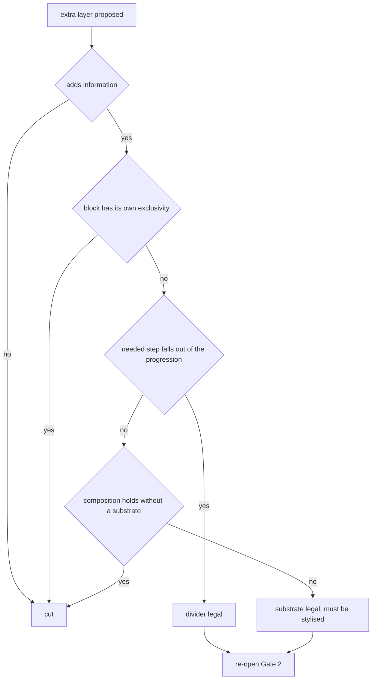

# Block Interior and Surface

> Loaded when: Spacing, grouping, dividers, substrates, nesting, alignment, type sizing, polish; or a critique is about to be phrased as "cleaner" or "more convenient".

This file works inside one block and on the surface layer above it. It never sets what should be emphasised — that is the charge column, `references/charges.md`. It sets whether a separation is carried by distance, by form, or by an added layer, and what that choice costs elsewhere. Every test below stops at a named consequence; none of them produces a verdict on an operation on its own — the sign comes from the Ledger, and the operation vocabulary lives in `references/operations.md`.

**Status note for this file.** Two claims below carry an explicit *provisional* marker because they are the ones most likely to be quoted as rules. They are not the only unverified material here: the verification pass covered the axes, the moves and the tensions, and several passages on this page — the structural layer laid over a feed, the free stop at the physical screen edge, neutrals as an instrument budget — are extraction-layer material it did not reach. Treat anything on this page without a CONFIRMED-, forbidden- or limit-tag as reconstruction that needs checking against the brief before it is asserted to anyone.

Precondition: run this layer only when the charge column already has a span. Entering here first — counting typefaces, fixing a spacing system, drawing corrections — is the failure this layer is most prone to, because everything here is measurable and therefore feels like progress.
RU: поверхность правится после того, как решены секвенция и заряды; вход с отступов и шрифтов — методологический брак.

## The unit of this layer: density and the informativeness ratio

A **density** is one countable unit of visual substance: a line, a rule, an outline, a substrate, an icon, a plate, a badge. Count them; do not judge them.
RU: плотность — счётная единица визуального вещества: линия, обводка, подложка, иконка, плашка.

**Parasitic density** is a density that weighs but carries no information. It is not defined by how it looks; it is defined by the ratio it damages.
RU: паразитарная плотность — весомая, но информационно пустая.

The **informativeness ratio** is information delivered divided by densities on the block. It falls with any duplication — of logic, of a separation, of a code.
RU: коэффициент информированности — информация, делённая на число плотностей; падает при любом дублировании.

Working consequence: duplicating logic does not help perception, it takes charge from the logic that does not duplicate. An icon beside the word it names, a chevron beside a row the platform already marks as tappable — these do not add; they spend the accent of the neighbour. Name the neighbour they charge before deciding anything. Whether the duplicate is a loss here is not settled by this file: it is settled against the Ledger, see `references/operations.md`.
RU: дублирующая логика отбирает акцент у той, что не дублируется.

Never argue that fewer densities make the interface faster. That is the model's own name for fake method (схематоз): a time claim owes a measurement artefact, and this one does not have one. The honest form is either an accent statement or an accuracy statement.
RU: «меньше плотностей — быстрее» — схематоз; утверждение о времени требует артефакта замера.

## Any extra layer: four ordered tests

An extra layer is a divider, a substrate, an outline, a plate, a rounded container, a translucent overlay. Run the tests in order and **stop at the first that fires**.

1. **Does it add information?** No → cut.
2. **Does the block already have its own exclusivity** — a difference from its neighbours that is doing the separating already? Yes → cut.
3. **Does the required spacing fall out of the progression** — is the step you need unreachable without breaking the ratio chain? Yes → the divider is legal.
4. **Does the composition fail to hold without a substrate?** Yes → the substrate is legal, and it is then obliged to be stylised — it must convert into the atemporal reading rather than sit there as bare structure.

RU: порядок фильтров — информированность → эксклюзивность → прогрессия отступов → компоновка; останавливаться на первом сработавшем.

Two prohibitions on top of the sequence, both structural, neither aesthetic:

- A layer may not duplicate a separation that already exists. Two instruments doing one job means one of them is a parasitic density by construction.
- A layer that passed the tests may not be so de-energised that removing it changes nothing. A legal layer that is invisible is a density paying no rent; either it separates or it goes.
  RU: законный слой не должен быть обесточен до «убери — ничего не изменится».

## Strokes, rules and substrates are members of the block ordering

An outline or a rule is a block in its own right, not decoration. Adding one is agreeing to balance it against content by charge, in a place where you did not plan an accent.
RU: обводка и линия — самостоятельные блоки секвенции; они набирают внимание там, где акцент не планировался.

Consequences to check before adding one:

- Structure laid over the feed costs more than the area it would have occupied. A permanently present structural layer is re-separated from content on every pass; that cost is paid at every contact, not once.
- A gap between a panel and the physical screen edge throws away a free stop for the pointer and for the gaze. The edge separates for nothing; a margin there buys nothing and is charged every time.
- A layer that eats separability — glow, blur, a soft shadow standing in for a boundary — is cancelled entirely, not softened, **wherever a group-membership error is possible on this carrier**. Separability is the thing the layer was supposed to produce, and the condition is a property of slot 5: someone has to be reading which block a datum belongs to. Counter-case: on a carrier where nothing has to be attributed to anything — a mark, a frame read at one glance, a one-pass surface with no membership decision — there is no separability to protect and a boundary-dissolving surface is a legal derivation. Name the membership decision before invoking this; if you cannot name one, it does not fire.
  RU: приём, съедающий отделимость блоков, отменяется целиком — там, где возможна ошибка принадлежности.
- A darkening plate or translucent overlay dropped over arbitrary content hands the contrast of your composition to whatever raster arrives. Counter-case: if the raster is yours to art-direct, prepare the place for the text inside the frame instead and the layer is unnecessary; if it is not yours, the layer is not a fix but a transfer of control.
- Each level of layer standing between the viewer and the substance is paid for in reading time and in sign-load; a substrate whose only content is "colour" is one such level. What that colour buys is decided in `references/sign.md`, not here.

## Separation by distance against separation by frame

Distance is the default instrument; a frame is a purchase. Hierarchy carried by contrast and by size does the work of frames and does it more precisely, because a frame separates equally in all directions while contrast and size separate in the direction you chose.
RU: иерархия, заданная контрастом и кеглем, заменяет рамки и работает точнее их.

- Before adding a substrate, build the future: count how many more substrates the next level of categorisation will force. A row is infinite; if the answer is "many", the instrument is wrong now, not later. Model the maximum configuration here and now — do not forecast a horizon in years, model the fullest state the data can reach.
  RU: до подложки — достроить будущее: сколько плашек придётся добавить дальше.
- **Two levels of card nesting is the confirmed limit.** For substrates, plates and other layer types, treat two as the working ceiling **by analogy** — that extension is this skill's, not the corpus's, and say so when you use it. At the third level the mechanism is: spacing stops separating, the steps between levels converge, membership of a sub-block to its parent disappears, and the screen fills edge to edge — and when every block is accented, no block is. Check the mechanism on this brief rather than counting to two; the count is the corpus's instance of it.
  RU: подтверждённый предел — два уровня карточек; распространение на прочие слои — расширение этого скилла, не корпуса.
- Having spent the nesting budget, **change the instrument, do not add a layer**: move the separation to colour, to spacing, to a divider, to a tab attached to the block edge without its own substrate (лепесток — provisional, not covered by the verification pass).
  RU: исчерпав глубину вложенности, меняют инструмент отделения, а не добавляют слой.
- A card is a layer, and layers are budgeted — so before a categorisation is expressed as cards, count the layers it will force at the fullest state the data can reach. The corpus's own instance of that count is that a card cannot organise the main groups, because doing so obliges the header and the date inside it to get layers of their own. Redo the count here; do not carry the verdict.
- If two blocks read as separate only because of a corner radius, spacing did not do its job. Form must not stand in for structure; fix the distance and the radius becomes free again.
  RU: блоки гарантированно разделяются отступами; форма не должна подменять структуру.
- Rounding compensation: an inner spacing set without regard to the outer radius groups worse and picks up a parasitic accent at the boundary (provisional — not covered by the verification pass).

## Spacing is a relation, not a number

The progression runs along one chain — letter → space → line → paragraph → block — and depth is carried by the **ratio** between neighbouring steps, not by the magnitudes.
RU: прогрессия отступов: буква → пробел → строка → абзац → блок; глубину несёт кратность, а не величина.

- Check three or four distances in a row (illustration — the point is the chain, not the count) rather than any single value. A value is not wrong or right; a step is.
- The multiplier the corpus supports for this chain is ×1.6–1.8 (norm; the author left the tolerance zone for deliberate exaggeration undefined — say so whenever you use it). Use it as the **shape of a progression you rebuild for this brief** at this carrier's viewing distance and content length, not as a value to apply: what travels is the chain, what does not travel is the number. Do not import the accent step of 2–4× between neighbours (illustration) into spacing, and do not import the spacing multiplier into accent: they are different instruments with different jobs.
- A spacing multiple of 3–4 is forbidden as a spacing rule (forbidden — it is the accent step; see `references/limits.md`). Multiples of four and eight are forbidden as an argument (forbidden — a guest's criterion the author disputes; see `references/limits.md`).
- Count by eye, not by ruler. Numerically equal inner and outer spacings read as stuck together; the reading is the datum, the number is the record of it.
- Spacing is a **range**: at the minimum it separates, at the maximum it starts grouping the block with a foreign group. Before choosing inside the range, ask whether there is a block on the other side at all.
  RU: отступ — диапазон: минимум отделяет, максимум начинает группировать с чужой группой.
- If an inner spacing is nearly equal to its outer, the binding has to be unwound by the viewer. Grouping that is not resolved by spacing before perception is transferred to the viewer as cognitive work, and that transfer is the cost you are actually arguing about.
- Break the progression only on one of three grounds, and name the ground out loud: (1) there is no block on the other side — the screen edge, where a smaller gap than the inter-block step is only an apparent violation, because the rule was generated by the entity "block against block"; (2) the separation is already carried by a non-spatial means; (3) the break actually pulled two concrete groups apart harder than the progression could. A fourth ground is invention.
  **Provenance rider, and it matters because this list is closed:** grounds (1) and (3) are the author's own. Ground (2) rests on a single passage from one conversation with a guest, so it is the weakest of the three — usable, and to be named as the weakest when you lean on it. A closed list one of whose members is that thin should be said out loud rather than quoted as settled.
  RU: правило проверяют через определение сущности, породившей это правило.

### The honest note: three irreconcilable spacing norms

The source holds three norms for spacing and does not arbitrate between them. State which one you used.

1. **Hard progression.** Outer greater than inner, the step no smaller than a fixed multiple, any deviation a loss of structure. Stated qualitatively on purpose: the corpus's own illustration of this norm runs at a multiple that verification has since ruled belongs to accent and not to spacing, so the figures are withheld here rather than printed as a working reading. What survives is the shape — outer greater than inner, and the step large enough that the two levels do not equalise.
2. **Deliberate exaggeration.** A break in the progression — edge spacing smaller than the inter-block step — is declared conscious, and the task is reformulated as finding the boundary of the zone where the break works. The author never fixed that boundary; the tension is open (see `references/limits.md`).
3. **Visual equality over pixels.** Count what reads, not what measures. Numerically equal spacings that read as merged are wrong at the correct number.

They are not one rule seen from three sides. Norm 1 and norm 2 disagree about whether a break is a defect; norm 1 and norm 3 disagree about what the evidence is. The common denominator the verification pass allows: spacing is chosen by the meaning that reads, and any rule is tested through the definition of the entity that generated it. Verification also rules that the multiple in norm 1 belongs to accent, not to spacing — which resolves the arithmetic conflict but not the disagreement about deliberate breaks. Do not present any of the three as settled method.

## Visual rules and desynchronisation

Every new weight, radius, case, numeral style, outline treatment, per-screen device is one **visual rule**. Their sum is the felt desynchronisation that authors explain to themselves as liveliness.
RU: каждое новое начертание, скругление, обводка — плюс одно правило; их сумма и есть ощущение расинхрона.

- Count the rules. The count is the measurement; there is no threshold to quote, and inventing one would be a fake number.
- A device used exactly once does not form a layer — it introduces noise. A device needs a second occurrence, or it goes.
- A difference must be either below the threshold of notice or explicit. The in-between — slightly different angles, nearly equal distances, a repeated thickness that is not quite repeated — is an undetermined structure: perception cannot tell whether to group or to split, and the result is discomfort with no nameable cause. This is what reads as inaccuracy.
  RU: различие либо ниже порога заметности, либо явное; промежуток — источник дискомфорта.
- Self-similarity is the opposite failure: predictable repetition of a rule fuses structures into one layer and accelerates exhaustion. Counter-case: on a row that should be collapsed into a single unit of comparison, self-similarity is the instrument, not the defect.

## Separability is the working criterion of every edit

After any change here, ask one question: can this block, and this step, still be read apart from its neighbour?
RU: отделимость — главный критерий проверки любой правки.

If the answer is no, the edit failed regardless of what it improved. This is the criterion that decides between two candidate fixes when both look acceptable.

## Type size, neutrals, and the accent price of a device

- Every visual device has a price in accent. Under accent scarcity it is the first thing thrown out, before any structural change.
  RU: каждая визуальная практика имеет цену в акценте; при дефиците акцента от неё отказываются первой.
- At small sizes hierarchy suffers and a few percent of contrast (illustration) already decides the reading. What was a free stylistic choice at large sizes becomes a charge decision at small ones.
- Neutrals (нейтраль) are an instrument budget, not a taste. A paradigm chosen without mid-tones has spent the means of *removing* accent before this layer begins; the cascade of outlines and stand-ins that follows is the interest on that. Note the price at Gate 1, where the paradigm is set, not here where it is paid.
- Deep neutrals warm and need pulling back toward cold; that is an accuracy fix, on the accuracy account below.

## Choosing between two acceptable variants

Draw the competing variants and compare them side by side at the same scale. This check is intuitive, not counted — treat it as evidence to be formalised afterwards, not as a measurement.
RU: варианты сравнивать рядом в одном масштабе; проверка на чуйке, не счётная.

Fork rule: the variant that inherits parameters already in use by neighbouring blocks wins. It wins because it adds no visual rule, which is a countable reason and can be stated. If you cannot say why one won, the choice was imprinting — see `references/argument.md`.

## Corner cases and the limiting case

- Run the extremes of the content: the longest and the shortest string, the empty state, the fullest state, the hostile image. Watch how positions move in the block ordering, not whether it "still looks fine".
- Model the **maximum configuration**. Dividers harmless at the minimum are ripple at the maximum; a substrate legal for a handful of items is a wall at the fullest state the data can reach.
- Test an aesthetic criterion at its limit. If the limit of the criterion yields nothing — perfect balance meaning perfectly equal charges, therefore no reading order at all — the criterion is wrong, and the effect you liked came from the disproportion it forbids.
  RU: проверяй эстетический критерий на пределе: если предел даёт пустоту, критерий неверен.

## The accuracy account

Route every fix at this layer by its **consequence**, not by how large it looks.

- If the fix changes group membership, or lets data merge with a foreign group, it is critical. Argue it through time and through the block ordering.
- If it does not, it is **accuracy** (аккуратность). Name it accuracy out loud, put it on the atemporal account, and stop dressing it as speed or convenience.
  RU: не меняется принадлежность — назови это аккуратностью и поставь на атемпоральный счёт.
- Polishing is charged against the atemporal account, so it is affordable only where that account still has budget after slot 8's required span has been met — it competes directly with the time a structural fix needed, and that competition is the derivation. The corpus's own three conditions for it paying off (a large audience; being compared against another designer; the fix falling out by itself inside a variant you were drawing anyway) come from T12 and are usable as the shape of the check. The word the corpus attaches to the failing case occurs exactly once in the whole corpus and is not a diagnosis you may hand anyone — see the single-occurrence register in `references/limits.md`.
- Accuracy is roughly a fifth of the assessment (illustration; verification corrected the inflated "about half" claim). It is visible to colleagues and to the client and is neutral on time — which is exactly why it is over-claimed.

## Backflow is mandatory

Any decision at this layer that redistributes accent re-opens Gate 2. Adding a divider adds a block to the ordering. Removing a substrate changes the exclusivity of everything that sat on it. Enlarging type moves the span.

When a gate re-opens, the affected Ledger line is **rewritten wholesale**, never patched. A patched Ledger is how a derivation quietly becomes a rationalisation of the drawing that already exists.
RU: перезаписывай строку целиком; залатанный вывод превращается в герменевтику макета.

## What this file does not decide

- Which block should carry the accent, and how wide the span must be — `references/charges.md`.
- Whether an added layer earns its sign-load, and what emptiness should be filled with — `references/sign.md`.
- The sign of any operation named here: adding, removing, duplicating, iconifying, de-energising — `references/operations.md`.
- Whether a number quoted here may be asserted at all, and the status of the open tension on spacing — `references/limits.md`.
