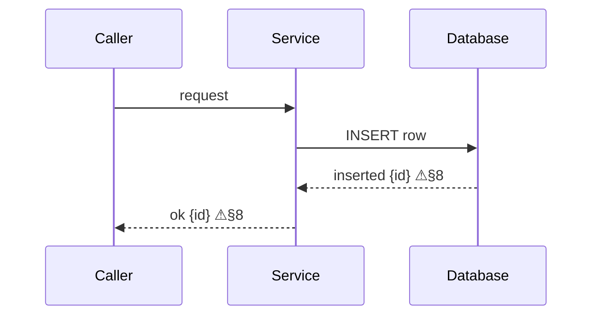
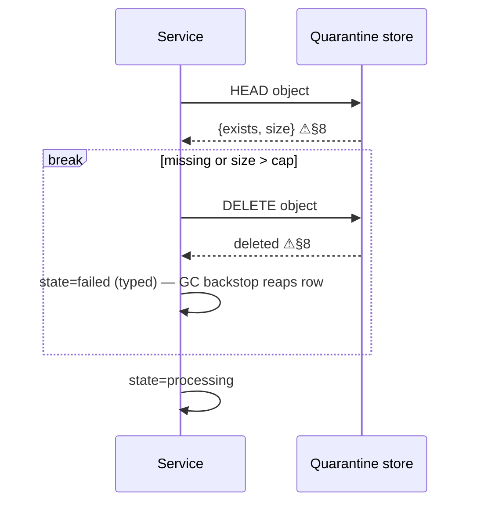
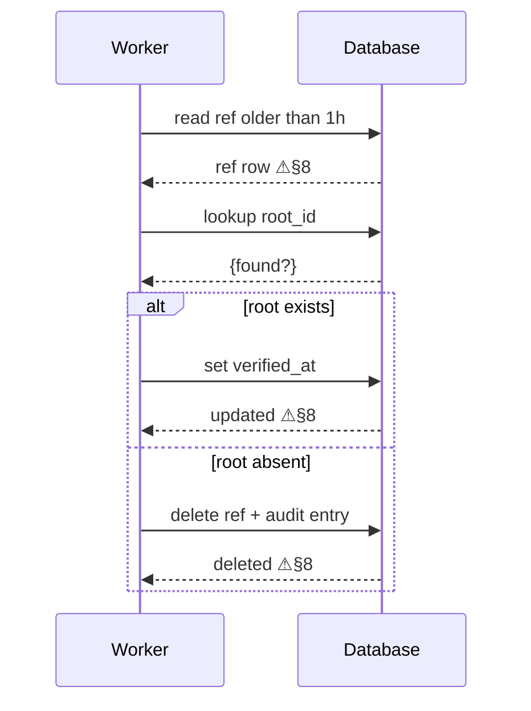
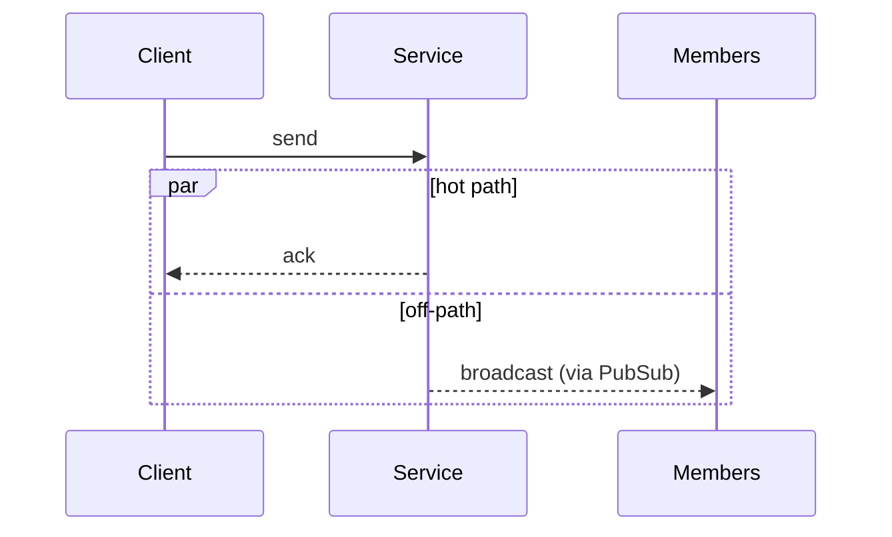

# Mermaid craft

Applies to every Mermaid diagram you write or edit.
Sequence diagrams first; per-type deltas are called out explicitly — rules differ between diagram types, never assume they transfer.

## Contents

- Parse safety
- One numbering system
- Honest structure
- Request/response and failure discipline
- Diagrams in specs — placement
- Validation is mandatory
- Base cases

## 1. Parse safety

- `;` is a statement separator ANYWHERE in a line (message text, Note, alias). Never use a raw `;` — rephrase or escape as `#59;`.
- The parser splits a message on the FIRST `:`. Later colons inside message text are safe; colons are NOT safe in `participant X as …` aliases or block titles.
- Escaping is HTML-entity style only: `#59;` `#35;` etc. Line breaks only via ` ` — keep source lines short and wrap deliberately.
- Never start a line of text with a Mermaid keyword: `end`, `loop`, `alt`, `else`, `opt`, `par`, `and`, `break`, `Note`, `rect`. Lowercase `end` is especially deadly inside blocks and in flowchart labels.
- `+` / `-` immediately after an arrow (`->>+`) is activation shorthand — do not let message punctuation drift into that position.
- Unicode (`→ ∈ µ ′ —`) is safe; prefer it over ASCII surrogates that need escaping.
- Flowchart-specific delta: `()[]{}` and quotes inside node labels require quoting (`id["label (x)"]`); in sequence diagrams they are safe.
- Comments are `%%` on their own line; never let `%%` appear in text.

## 2. One numbering system

Either `autonumber` OR domain step numbers embedded in message text — never both.
If the diagram must reference steps of an external spec, drop `autonumber` and carry the spec's own numbers.

## 3. Honest structure

- **Concurrency is `par … and … end`** (or an explicit Note stating "runs concurrently with …"). A sequence diagram lies about ordering by default; never render concurrent phases as if sequential.
- **An arrow is the real transport.** Do not draw logical delivery as a direct edge that bypasses the actual intermediary (e.g. worker → clients when delivery goes via PubSub → gateway). Either route the arrows through the intermediary or annotate the edge (`via X`).
- Ordering within the diagram must match the ordering the text claims. If a hot-path reply intentionally precedes an off-path broadcast, wrap them in `par` instead of drawing a misleading sequence.

## 4. Request/response and failure discipline

- **Every request arrow has a response arrow** (`-->>`), always. For streams the response is the stream itself (`stream opened` / `chunks`). A request with no drawn response is a defect — branches end up dangling with nothing to branch on.
- **Every edge case is a branch on a response.** The branch block goes immediately after the response arrow it branches on, and the branch title IS a response outcome (`alt 200 ok` / `else 404 or oversize`) — never an abstract condition floating after a request. A reader must be able to point at the response value that selected the branch. (Crash/timeout of the caller itself, where no response exists, is the one exception — model it as `break crash before response` with a Note on recovery.)
- **Block choice — does the flow continue after the block?**
  - `alt`/`else` — branches after which the depicted flow **continues** (business divergence, fallbacks, degraded modes — even when triggered by a failure, e.g. cache miss → DB fallback).
  - `break` — the branch **exits** the depicted flow early (typically a failure that aborts the trip, but also e.g. duplicate-request → return cached reply, done).
  - `opt`/`loop` — retries and optional steps.
  Heuristic: conditions usually read as `alt`, failures usually as `break` — but the law is continuation, not failure-ness.
- **Classic outcomes are referenced, not drawn.** Standard contract (typed error → caller retries with backoff; no state to clean or generic GC covers it) is marked with the `⚠§N` suffix on the response arrow, where §N is the document's failure-modes section:
  `PG-->>GW: inserted {id} ⚠§8`
  Reading: "other outcomes of this call are classic — see §8". Define the marker once per document (legend line) if the doc has outside readers.
- **Non-classic outcomes are drawn.** If the failure changes the *recovery topology* — compensation, cleanup, idempotent retry with a different path, fail-toward-retention, race resolution — it gets its explicit `alt`/`break` branch. Never prose "if fails…" inside message text.

Review invariant: walk every request — it has a response; every response either carries `⚠§N` or its non-classic outcomes are branched; every non-classic branch has a row in the failure-modes table. Gaps found this way are spec bugs — surface them, don't silently fix.

## 5. Diagrams in specs — placement

Document-level placement rules — diagram-first for flows, one home per fact, the
complement test — live in the parent skill:
[SKILL.md § One home per fact](../SKILL.md#1-one-home-per-fact). This file governs the
diagram itself; that section governs where a diagram sits in a document and what the
surrounding prose may repeat.

## 6. Validation is mandatory

Never trust eyeballing — `;`-class bugs are invisible. Before committing, machine-validate the diagram (`mmdc`, `mermaid.parse`, or mermaid.live). If no validator is available in the environment, say so explicitly rather than claiming the diagram is valid.

## 7. Base cases

Classic outcomes referenced via `⚠§N` on the response:

Non-classic outcome — branch on the response, early exit with `break`:

Divergent outcomes with `alt` on the response:

Concurrency with `par` (hot-path reply vs off-path broadcast):

