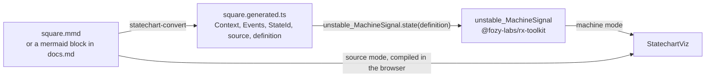

# statechart

Statechart tooling for [`@fozy-labs/rx-toolkit`](https://github.com/fozy-labs/rx-toolkit): write a state machine as a
Mermaid diagram, compile it into a typed `createMachine` definition, run it in a live React visualizer.

The diagram is the source. A `stateDiagram-v2` file — or a `mermaid` block inside a Markdown document — carries the
structure; `%% @…` comment directives carry the types, guards, actions and delays. The file stays valid Mermaid and
renders anywhere, with no plugin.

## Packages

| Package | Version | What it does |
| --- | --- | --- |
| [`@fozy-labs/statechart-converter`](packages/converter/README.md) | [](https://www.npmjs.com/package/@fozy-labs/statechart-converter) | Node library and `statechart-convert` CLI. Compiles `.mmd` or `.md` into `*.generated.ts` exporting `Context`, `Events`, `StateId`, `source` and `definition`. |
| [`@fozy-labs/statechart-viz`](packages/viz/README.md) | [](https://www.npmjs.com/package/@fozy-labs/statechart-viz) | React `<StatechartViz />`. Renders a running machine on its own diagram: active states highlighted, transitions clickable, event log and context alongside. |

Both packages ship under the `@fozy-labs` scope on one shared version — one git tag, one
[CHANGELOG](CHANGELOG.md) section, one [release procedure](RELEASING.md).

## How the pieces fit



The converter is a build-time step: it produces TypeScript you commit and import. The visualizer accepts either the
compiled definition (`machine` mode) or the diagram text itself (`source` mode), compiling it on the fly.

## Quickstart

Write the machine:

```
stateDiagram-v2
    %% @machine square
    %% @context type: { result: number | null }
    %% @context initial: { result: null }
    %% @event SQUARE: { value: number }

    [*] --> idle

    %% @action square: context.result = event.value ** 2
    idle --> done: SQUARE / square
    done --> idle: RESET
```

Compile it:

```sh
npm install --save-dev @fozy-labs/statechart-converter
npx statechart-convert square.mmd
#=> square.generated.ts
```

Run it, and watch it run:

```tsx
import { unstable_MachineSignal as MachineSignal } from "@fozy-labs/rx-toolkit";
import { StatechartViz } from "@fozy-labs/statechart-viz";
import { definition } from "./square.generated";

const square$ = MachineSignal.state(definition);

<StatechartViz machine={square$} />;
```

The input language is documented in the [converter README](packages/converter/README.md); the component's props,
modes and theming in the [viz README](packages/viz/README.md). The `createMachine` config format, `MachineSignal` and
`toMermaid()` belong to the library, where they are still experimental and exported as `unstable_createMachine` /
`unstable_MachineSignal` — alias them on import, as above:
[rx-toolkit statechart docs](https://github.com/fozy-labs/rx-toolkit/blob/v0.12.0/docs/statechart/README.md).

## Working in the repo

pnpm, at the version pinned by the root `packageManager` field — corepack picks it up. Node `>=20.19.0`.
End-to-end tests need a Playwright browser: `pnpm --filter ./packages/viz exec playwright install chromium`.

```sh
pnpm install                          # one pnpm-lock.yaml at the root
pnpm run build                        # converter, then viz — the order matters
pnpm run check:all                    # build + per-package tsc, vitest, eslint, prettier, and viz e2e
pnpm --filter ./packages/viz run dev  # playground on http://localhost:3100
```

| Script | Runs |
| --- | --- |
| `build` | `pnpm -r run build` — topological order, so converter then viz |
| `ts-check` | converter build, then `tsc --noEmit` in both packages |
| `test` | converter build, then Vitest in both packages |
| `test:e2e` | converter build, then Playwright against the viz playground |
| `lint` / `lint:fix` | ESLint in both packages |
| `format` / `format:check` | Prettier in both packages |
| `check:all` | `build`, then each package's own `check:all` |

**Build the converter before running any viz script directly.** viz consumes it as an ordinary installed package:
`packages/viz/node_modules/@fozy-labs/statechart-converter` is a symlink created by the `workspace:^` protocol, and
its `exports` point at `packages/converter/dist/`. Type-checking, unit tests, the dev server and the library build
all read that `dist/`. `pnpm -r` walks the workspace in topological order, so the root scripts above build it first;
running `pnpm --filter ./packages/viz run …` on its own skips that step — run
`pnpm --filter ./packages/converter run build` yourself. Vite serves the linked package as source rather than
pre-bundling it, so a rebuilt `dist/` is picked up without `--force` (see the comment in
`packages/viz/vite.config.ts`).

```
package.json          workspace root: scripts and the pinned packageManager
pnpm-workspace.yaml   workspace members, and the allowBuilds list
pnpm-lock.yaml        the only lockfile in the repository
packages/converter/   @fozy-labs/statechart-converter
packages/viz/         @fozy-labs/statechart-viz
```

Code, comments and documentation are written in English. Commits follow
[Conventional Commits](https://www.conventionalcommits.org/en/v1.0.0/).

## Provenance

Both packages were extracted from the [fozy-labs/rx-toolkit](https://github.com/fozy-labs/rx-toolkit) monorepo at commit
[`a001b0a`](https://github.com/fozy-labs/rx-toolkit/commit/a001b0abaa6f98c270687cb24be92f1c6c12a545) (branch
`feat/state-machine`, tag `v0.12.0-rc.1`): `apps/converter` became `packages/converter`, `apps/viz` became
`packages/viz`. File history before the extraction lives in the original repository; the import commits here name the
same commit and paths.

Three things changed in the move: the library is consumed from npm instead of `file:../..`; generated files are
type-checked against the installed package rather than the library sources; and the `*.generated.ts` fixtures used by
the viz type tests are produced by this workspace's own converter.

## License

[MIT](LICENSE) © Vladimir Panev
