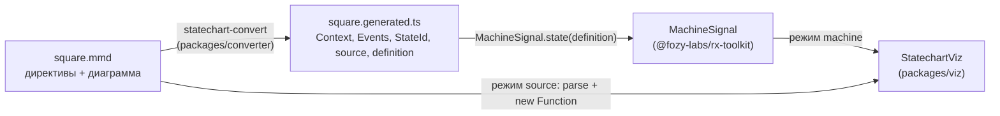

# statechart

Инструменты для statechart-модуля [`@fozy-labs/rx-toolkit`](https://github.com/fozy-labs/rx-toolkit): машина описывается
одним `.mmd`-файлом (mermaid `stateDiagram-v2` + директивы `%% @…`), конвертер превращает его в типизированный
`createMachine`, viz показывает живую диаграмму.

## Содержание

- [Пакеты](#пакеты)
- [Связь с rx-toolkit](#связь-с-rx-toolkit)
- [Установка и использование](#установка-и-использование)
- [Разработка](#разработка)
- [Происхождение](#происхождение)
- [Лицензия](#лицензия)

## Пакеты

| Пакет                             | Каталог                                                | Что делает                                                                                                                       |
|-----------------------------------|--------------------------------------------------------|----------------------------------------------------------------------------------------------------------------------------------|
| `@fozy-labs/statechart-converter` | [`packages/converter`](packages/converter/README.md)   | Node-библиотека и CLI `statechart-convert`: `.mmd` → `*.generated.ts` (`Context`, `Events`, `StateId`, `source`, `definition`) |
| `@fozy-labs/statechart-viz`       | [`packages/viz`](packages/viz/README.md)               | React-компонент `StatechartViz`: диаграмма mermaid с подсветкой активных состояний, отправка событий кликом, лог и `context`    |



## Связь с rx-toolkit

- Библиотека — зависимость из npm: `@fozy-labs/rx-toolkit@0.12.0-rc.1` (dist-tag `rc`). Конвертер валидирует конфиг её
  `createMachine` и генерирует импорт из неё; viz объявляет её peer-зависимостью `>=0.12.0-rc.1` (нужны `mutate` и
  `definition.source`).
- Модуль statechart — формат конфигурации, `MachineSignal.state`, `toMermaid()`, авторинг в `.mmd` — документирован в
  библиотеке: [docs/statechart/README.md](https://github.com/fozy-labs/rx-toolkit/blob/v0.12.0-rc.1/docs/statechart/README.md),
  раздел [Авторинг машины в .mmd](https://github.com/fozy-labs/rx-toolkit/blob/v0.12.0-rc.1/docs/statechart/README.md#авторинг-машины-в-mmd).
- Подмножество mermaid, грамматика подписи перехода и директивы — в [README конвертера](packages/converter/README.md);
  пропсы, режимы и ограничения — в [README viz](packages/viz/README.md).

## Установка и использование

Оба пакета публикуются в npm под scope `@fozy-labs` синхронно, одной версией (история — [CHANGELOG.md](./CHANGELOG.md),
процедура — [RELEASING.md](./RELEASING.md)). Ниже — работа из репозитория и как зависимость проекта.

### Конвертер

```bash
# из репозитория (после npm install && npm run build -w packages/converter)
node packages/converter/dist/cli.js path/to/square.mmd            # → path/to/square.generated.ts
node packages/converter/dist/cli.js path/to/square.mmd --out x.ts

# как зависимость проекта
npm install --save-dev @fozy-labs/statechart-converter
npx statechart-convert path/to/square.mmd
```

Программный API (`convert`, `parse`, `emit`, `validateMachineConfig`, `StatechartParseError`) —
в [README конвертера](packages/converter/README.md#использование).

### Viz

```bash
npm install @fozy-labs/statechart-viz @fozy-labs/rx-toolkit@rc mermaid react react-dom rxjs
```

```tsx
import { MachineSignal } from "@fozy-labs/rx-toolkit";
import { StatechartViz } from "@fozy-labs/statechart-viz";
import { definition as square } from "./square.generated";

const square$ = MachineSignal.state(square);
<StatechartViz machine={square$} />;
```

Режим `source` (текст `.mmd` вместо машины) подгружает конвертер и компилятор TypeScript через `import()` и исполняет
тела директив через `new Function` — следствия для CSP в [README viz](packages/viz/README.md#правило-eval--csp).

## Разработка

Требования: Node `>=20.19.0` (`engines`), для e2e — браузер Playwright (`npx playwright install chromium`).

```bash
npm install                  # один lockfile в корне; @fozy-labs/rx-toolkit — из npm, конвертер связан с viz workspace-ссылкой
npm run build                # converter → viz (порядок важен, см. ниже)
npm run check:all            # build, затем check:all каждого пакета: tsc, vitest, eslint, prettier; у viz ещё Playwright e2e
npm run test                 # vitest обоих пакетов (перед этим собирает конвертер)
npm run ts-check / lint / format:check
npm run test:e2e             # Playwright viz
npm run dev -w packages/viz  # playground viz на http://localhost:3100
```

Порядок сборки. viz видит конвертер как обычный установленный пакет: `node_modules/@fozy-labs/statechart-converter` —
workspace-ссылка на `packages/converter`, которая по `exports` ведёт в его `dist/`. Типы (`tsc`), unit-тесты (vitest),
dev-сервер и сборка библиотеки читают именно `dist/`, поэтому конвертер собирается первым: корневые скрипты `build`,
`ts-check`, `test`, `test:e2e`, `check:all` делают это сами; перед запуском скриптов viz напрямую
(`npm run … -w packages/viz`) выполните `npm run build -w packages/converter`. Vite отдаёт связанный пакет как исходники
(без пре-бандла), пересобранный `dist/` подхватывается без `--force` — подробности в комментарии
`packages/viz/vite.config.ts`.

```
package.json          корень workspace: скрипты, единственный package-lock.json
packages/converter/   @fozy-labs/statechart-converter
packages/viz/         @fozy-labs/statechart-viz
```

Соглашения: код и комментарии — на английском, документация — на русском; Conventional Commits.

## Происхождение

Пакеты извлечены из монорепозитория [fozy-labs/rx-toolkit](https://github.com/fozy-labs/rx-toolkit), коммит
[`a001b0a`](https://github.com/fozy-labs/rx-toolkit/commit/a001b0abaa6f98c270687cb24be92f1c6c12a545) (ветка
`feat/state-machine`, тег `v0.12.0-rc.1`): `apps/converter` → `packages/converter`, `apps/viz` → `packages/viz`.
История файлов до извлечения — в исходном репозитории; коммиты импорта здесь ссылаются на тот же коммит и пути.
Изменения при извлечении: библиотека берётся из npm вместо `file:../..`; сгенерированные файлы проверяются `tsc`
против установленного пакета, а не исходников библиотеки; `*.generated.ts` для type-теста viz генерирует конвертер
этого workspace.

## Лицензия

[MIT](LICENSE) © Vladimir Panev
