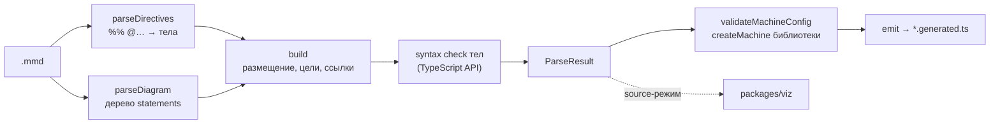

# statechart-converter

Конвертер `.mmd` — mermaid `stateDiagram-v2` плюс директивы `%% @…` — в типизированный
`*.generated.ts` с `createMachine` из `@fozy-labs/rx-toolkit`. Парсер собственный, построчный;
mermaid (11.17.2) нужен только тестам как дифференциальный оракул. Файл остаётся валидным mermaid
и рендерится без плагинов. Обратное направление — `definition.toMermaid()` библиотеки
([toMermaid](https://github.com/fozy-labs/rx-toolkit/blob/v0.12.0-rc.1/docs/statechart/README.md#экспорт-в-mermaid-tomermaid)): его текст конвертер
разбирает в тот же конфиг.

## Содержание

- [Использование](#использование)
- [Конвейер](#конвейер)
- [Подмножество mermaid](#подмножество-mermaid)
- [Подпись перехода](#подпись-перехода)
- [Директивы](#директивы)
- [Размещение состояний](#размещение-состояний)
- [Сгенерированный файл](#сгенерированный-файл)
- [Проверки](#проверки)

## Использование

```bash
npm run convert -- path/to/square.mmd            # → path/to/square.generated.ts (из packages/converter: build + cli)
npm run convert -- path/to/square.mmd --out x.ts  # -o x.ts
npx statechart-convert path/to/square.mmd         # в проекте, где пакет установлен
```

```ts
import { convert, emit, parse, StatechartParseError, validateMachineConfig } from "@fozy-labs/statechart-converter";

const { code, parsed } = convert(text, { fileName: "square.mmd" }); // parse + validateMachineConfig + emit
const result = parse(text);                    // ParseResult — конфиг, тела, ссылки, состояния
validateMachineConfig(result);                 // createMachine библиотеки над конфигом (без реализаций)
const source = emit(result, { importFrom: "@fozy-labs/rx-toolkit", fileName: "square.mmd" });
```

Любая ошибка — `StatechartParseError` с `line`, `column?` и `path?` (путь состояния или области
в конфиге); `format()` даёт `line:column: message (at path)`, CLI печатает `<файл>:` перед ним и
завершается с кодом 1 (2 — неверные аргументы). Ошибка `createMachine` приходит с текстом библиотеки,
`path` — состояние, которому она принадлежит, `line` — строка этого состояния (`states[].line`);
для корня — строка заголовка.

## Конвейер



## Подмножество mermaid

| Конструкция                                   | Семантика                                                                 |
|-----------------------------------------------|---------------------------------------------------------------------------|
| `stateDiagram-v2`                             | заголовок; выше него — только пустые и `%%`-строки                        |
| `[*] --> A` в области                         | `initial` области; ровно один на область                                  |
| `A --> [*]`                                   | переход в синтетическое `$final` области, где написана строка             |
| `A --> B: подпись`                            | переход, см. [Подпись перехода](#подпись-перехода)                        |
| `A --> B`                                     | eventless (`always`)                                                      |
| `A --> B: done`                               | `onDone` compound-состояния `A`                                           |
| `A --> B: after 3000` / `after name`          | `after`; имя объявляется `@delay`                                         |
| `state X {` … `}`                             | compound; `{` в конце строки, `}` отдельной строкой                       |
| `--` внутри блока                             | parallel-регионы `$0`, `$1`, … по порядку                                 |
| `state "Описание" as X` (+ `{`)               | `description`                                                             |
| `state X <<choice>>`                          | choice: исходящие переходы без триггера, кандидаты `always` по порядку    |
| `X` отдельной строкой                         | объявление состояния в области (так пишет `toMermaid()`)                  |
| `note left|right of X: …`, `note … end note`  | игнорируется, но `X` считается упоминанием                                |
| `direction`, `classDef`, `class`, `:::cls`    | игнорируются                                                              |
| `%% …` в начале строки                        | директива или комментарий, см. [Директивы](#директивы)                    |

Id состояний — `NAME` (см. грамматику ниже); `$…` зарезервированы, `__proto__` запрещён (ключ
plain-объекта). Всё остальное — ошибка со
строкой, в том числе то, что mermaid принимает, но рисует не так, как написано: `<<fork>>`,
`<<join>>`, иные стереотипы, `[H]`/`[H*]`, `state X` без тела, `[*] --> X: подпись`, `[*] --> [*]`,
`X : описание`, `stateDiagram` (v1), front matter `---`, `%%{init}`, `;` в строке перехода и в
однострочной `note`, `%%` не в начале строки, блок или регион без `[*] -->`, `--` вне блока.

## Подпись перехода

```
label   := trigger? guard? actions?
trigger := EVENT | "after" (INT | NAME) | "done"
guard   := "[" NAME "]"
actions := "/" NAME ("," NAME)*
EVENT   := NAME
NAME    := [A-Za-z_][A-Za-z0-9_]*
INT     := [0-9]+            (без ведущих нулей)
```

- `after` и `done` зарезервированы: событие с таким именем — ошибка.
- Имя в `[…]`, после `/` и после `after` должно быть объявлено директивой того же вида.
- Алфавит — `NAME`, цифры, `[ ] / ,` и пробелы; любой другой символ — ошибка (mermaid молча
  обрезает подпись на `;`).

## Директивы

```
directive := "%%" SP* "@" KIND (SP+ HEAD)? (":" SP* INLINE)?
continue  := "%%" SP+ LINE          -- продолжение тела ближайшей директивы выше
KIND      := machine | context | event | guard | action | delay
```

| Директива                    | Тело                        | Семантика                                            |
|------------------------------|-----------------------------|------------------------------------------------------|
| `@machine <id>`              | —                           | id машины (`NAME`); ровно одна                       |
| `@context type: <ts-type>`   | TS-тип                      | `Context` сгенерированного файла                     |
| `@context initial: <expr>`   | JS-выражение                | начальный `context`                                  |
| `@event NAME: <ts-type>`     | TS-тип payload              | `{ type: "NAME" } & payload`; без директивы — только `type` |
| `@guard NAME: <expr>`        | JS-выражение → boolean      | область видимости `context`, `event`                 |
| `@action NAME: <statements>` | JS-операторы                | `context` — Immer-draft, если тело его читает        |
| `@delay NAME: <expr>`        | JS-выражение → мс           | для `after NAME`                                     |

- Тело — inline после `:` и/или следующие `%%`-строки; заканчивается на следующей `%% @` или
  любой не-`%%`-строке. Общий отступ продолжений снимается; `%%` без текста — пустая строка тела;
  `%%текст` (без пробела) — комментарий, завершающий тело. Обычный комментарий `%% …` сразу под
  директивой становится её телом.
- Директива может стоять где угодно: до заголовка, в корне, внутри `state X { }`.
- Повтор имени внутри вида, повтор `@machine`, `%%{`, неизвестный вид, пустое тело,
  объявленное и не использованное `@event` — ошибки.
- Тела проверяются на синтаксис компилятором TypeScript в той же обёртке, в которой они попадут в
  файл; ошибка указывает на строку и колонку директивы.

## Размещение состояний

Правило повторяет рендер mermaid 11.17.2 (проверено дифференциальными тестами по `getData()`):

- Состояние принадлежит блоку (`state X { }` или региону `--`), который его упоминает — концом
  перехода, объявлением или целью `note`. Упоминания в корне ничего не размещают: состояние
  только из корня — корневое.
- Упоминание внутри двух разных блоков — ошибка `duplicate state id` (mermaid молча оставил бы
  последний); упоминание внутри собственного блока — ошибка.
- Цель-сосед пишется ключом (`"working"`), иначе — абсолютным путём `#<machineId>.<путь>`
  (`#trafficLight.working.green`); пути регионов — `active.$0`.
- Переход без guard и actions — голая строка цели, иначе объект; несколько переходов одного
  триггера из одного состояния — массив в порядке строк. В массивах `after` / `onDone` каждый
  кандидат — объект (`createMachine` не принимает там голые строки).
- `done` требует compound/parallel-источник; из choice-состояния выходят только переходы без
  триггера.

## Сгенерированный файл

- `// AUTO-GENERATED from <файл> — do not edit`, импорт только используемых имён из `importFrom`
  (`createMachine`, `mutate`, `type ActionArgs`, `type GuardArgs`, `type MachineEvent`).
- `Context` — текст `@context type`; обе `@context`-директивы либо есть, либе нет (иначе ошибка
  `emit`); без них — `Context = {}` и `context: {}`.
- `Events` — объединение по событиям из подписей в порядке первого появления; без событий — `never`.
- `StateId` — пути всех состояний, регионы включены, `$final` нет.
- `source` — исходный текст дословно.
- `definition = createMachine<Context, Events>(конфиг, реализации)`; второй аргумент опускается,
  когда таблицы пусты.
- Тип `event` в guard/action сужен до событий переходов, которые на него ссылаются:
  `Extract<Events, { type: "A" | "B" }>`; для `always`/`after`/`done` или без ссылок —
  `MachineEvent<Events>`; delay — всегда `MachineEvent<Events>`.
- Деструктурируются только те аргументы, которые тело читает (по AST, строки и `x.context` не в
  счёт); action, читающий `context`, оборачивается в `mutate(...)`, остальные — обычные функции.
- Тела — дословно, только с переотступом; выражения в скобках: `=> (expr)`.

## Проверки

`npm run check:all` = `ts-check` + `test` + `lint` + `format:check`. Тесты: дифференциальные против
mermaid 11.17.2 (дерево `getRootDocV2()`, размещение по `getData()`, причуды парсера mermaid),
unit-тесты слоёв, негативные на каждую отвергаемую конструкцию, снапшоты примеров
`test/fixtures/*.mmd`, round-trip `parse(definition.toMermaid())` = конфиг для набора конфигов
библиотеки (`test/roundTripFixtures.ts`; тела директив тест подставляет сам — `toMermaid` их не
восстанавливает), `tsc --strict` над сгенерированными файлами против установленного пакета
`@fozy-labs/rx-toolkit` (его `dist/*.d.ts` из `node_modules` — то, что видит потребитель; декларации
библиотеки при этом проверяются явно, без `skipLibCheck`). Перед записью `convert` прогоняет конфиг через `createMachine` библиотеки — невалидная машина
падает при конвертации, не в рантайме.
