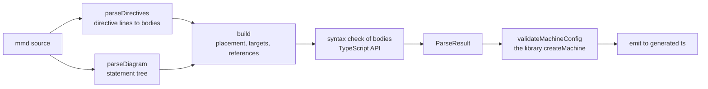

# @fozy-labs/statechart-converter

[](https://www.npmjs.com/package/@fozy-labs/statechart-converter)
[](../../LICENSE)

Compiles a Mermaid `stateDiagram-v2` into a typed `createMachine` definition for
[`@fozy-labs/rx-toolkit`](https://github.com/fozy-labs/rx-toolkit). The diagram carries the structure, `%% @…`
directives carry the types and the implementation bodies, and the file stays valid Mermaid throughout.

```
stateDiagram-v2
    %% @machine square
    %% @context type: { result: number | null }
    %% @context initial: { result: null }
    %% @event SQUARE: { value: number }

    [*] --> idle

    %% @action square: context.result = event.value ** 2
    idle --> done: SQUARE / square
    done --> idle: RESET
```

```ts
// AUTO-GENERATED from square.mmd — do not edit
import { unstable_createMachine as createMachine, mutate, type ActionArgs } from "@fozy-labs/rx-toolkit";

export type Context = { result: number | null };

export type Events =
    | { type: "RESET" }
    | ({ type: "SQUARE" } & { value: number });

export type StateId = "idle" | "done";

export const source = `stateDiagram-v2 …`;

export const definition = createMachine<Context, Events>(
    {
        id: "square",
        source,
        context: { result: null },
        initial: "idle",
        states: {
            idle: { on: { SQUARE: "done" } },
            done: { on: { RESET: "idle" } },
        },
    },
    {
        actions: {
            square: mutate(({ context, event }: ActionArgs<Context, Extract<Events, { type: "SQUARE" }>>) => {
                context.result = event.value ** 2;
            }),
        },
    },
);
```

The reverse direction is the library's `definition.toMermaid()`
([docs](https://github.com/fozy-labs/rx-toolkit/blob/v0.12.0/docs/statechart/README.md)): its output parses back
into the same config, which the round-trip tests enforce.

The parser is hand-written and line-based. Mermaid itself, pinned to 11.17.2, is a development dependency only — the
test suite uses it as a differential oracle.

## Install

```sh
npm install --save-dev @fozy-labs/statechart-converter
```

Requires Node `>=20.19.0`. Two runtime dependencies come with the package: `@fozy-labs/rx-toolkit`, whose
`createMachine` validates the config before anything is written, and `typescript`, which syntax-checks the directive
bodies.

## Command line

```console
$ statechart-convert --help
Usage: statechart-convert <in.mmd|in.md> [options]

Converts a Mermaid stateDiagram-v2 with %% @directives into a typed statechart
definition. In a Markdown document every ```mermaid block carrying a
%% @machine directive is a machine; without --machine / --all the first one is
converted.

Default output: <in>.generated.ts next to the input, <id>.generated.ts for a
machine named with --machine / --all.

Options:
  -m, --machine <id[=file]>  machine to convert, repeatable (Markdown only)
      --all                  every machine of the document (Markdown only)
  -o, --out <file>           output file; only with a single machine
      --format <mmd|md>      input format; default: by file extension
  -h, --help                 show this help
```

The input format follows the extension — `.md` and `.markdown` are documents, everything else is a bare diagram —
and `--format` overrides it. Every file that gets written is printed to stdout, one path per line.

#### Convert a single diagram

```sh
statechart-convert src/square.mmd            #=> src/square.generated.ts
statechart-convert src/square.mmd -o gen/square.ts
```

#### Convert one machine out of a Markdown document

```sh
statechart-convert docs/flows.md             #=> docs/flows.generated.ts   (the first machine)
statechart-convert docs/flows.md -m order    #=> docs/order.generated.ts
```

#### Convert several machines, each to its own file

```sh
statechart-convert docs/flows.md -m order=src/order.generated.ts -m payment=src/payment.generated.ts
statechart-convert docs/flows.md --all       #=> <id>.generated.ts next to the document, for every machine
```

> [!NOTE]
> `--out` applies only when the output path is not already implied. Under `--machine <id>` the file is always
> `<id>.generated.ts` next to the input and `--out` has no effect — write `--machine <id>=<file>` to place it.

Every machine is converted before anything is written, so a failure in one of them leaves no half-generated document.
Writing itself is sequential: an I/O error on the second file leaves the first one on disk.

| Exit code | Meaning |
| --- | --- |
| `0` | help printed, or every output written |
| `1` | input unreadable, conversion failed, two machines resolved to the same path, or a write failed |
| `2` | bad arguments |

Conversion errors go to stderr as `<input>:<line>[:<column>]: <message> [(at <path>)]`:

```console
$ statechart-convert bad.mmd
bad.mmd:4:15: `;` is not allowed: mermaid reads it as a statement separator (one statement per line)

$ statechart-convert no-initial.mmd
no-initial.mmd:4: state `a` has no initial state: add `[*] --> <state>` (at a)
```

## API

```ts
import { convert, emit, parse, StatechartParseError, validateMachineConfig } from "@fozy-labs/statechart-converter";

const { code, parsed } = convert(text, { fileName: "square.mmd" });
```

### `convert(text, options)`

`parse` → `validateMachineConfig` → `emit`. Returns `ConvertResult` — `{ code, parsed }`: the file contents and
the parse result behind them. `options` is `ConvertOptions`: `fileName` (required, used in the header comment and in
error messages) plus everything in `EmitOptions`.

### `parse(text)`

Returns `ParseResult`: the `createMachine` config, the `@context` type and initial expression, the declared `events` /
`guards` / `actions` / `delays` with their bodies and source lines, a reverse index of which transitions reference
each guard and action, and the flat list of states with their config paths and lines.

### `emit(parsed, options?)`

Renders a `ParseResult` as TypeScript. `EmitOptions`:

- `importFrom` — the module the generated file imports from. Default `"@fozy-labs/rx-toolkit"`.
- `fileName` — only its base name reaches the header comment.
- `sourceLabel` — replaces the file name in the header comment outright.

With neither of the last two the header reads `// AUTO-GENERATED — do not edit`.

`emit` throws when exactly one half of the context pair is declared — `@context initial` without `@context type`, or
the reverse. `parse` accepts either half on its own, so this one surfaces at emit time.

### `validateMachineConfig(parsed)`

Feeds the config to the library's own `createMachine` — on a structural clone, with an empty context and no
implementations — before anything is written. A rejected config throws `StatechartParseError` carrying the library's
message, the offending state as `path`, and that state's line. This is the gate that catches what the grammar cannot:
`%% @delay Infinity: 1000` parses cleanly and fails here with `numeric delay must be a non-negative finite number`.

### `StatechartParseError`

Every failure is a `StatechartParseError` with `line`, optional `column` and optional `path` — the state or scope
inside the config. `format()` renders `line[:column]: message [(at path)]`, omitting whichever parts are absent.

### Markdown helpers

```ts
import {
    convertMarkdown,
    convertStatechartBlock,
    extractMermaidBlocks,
    findStatechartBlocks,
    parseMarkdown,
    parseStatechartBlock,
    selectStatechartBlock,
} from "@fozy-labs/statechart-converter";

const blocks = findStatechartBlocks(md);              // every block declaring %% @machine
const block = selectStatechartBlock(blocks, "order"); // without a name: the first one
const { code } = convertMarkdown(md, { fileName: "flows.md", machine: "order" });
```

`extractMermaidBlocks` returns every Mermaid block, statechart or not. `parseMarkdown` and `convertMarkdown` select a
block and process it; `parseStatechartBlock` and `convertStatechartBlock` take a block you selected yourself. All of
them report positions in document coordinates.

### Types

`ParseResult`, `MachineConfigJson`, `StateNodeJson`, `TransitionJson`, `TransitionListJson`,
`DelayedTransitionListJson`, `TransitionObjectJson`, `StateInfo`, `DirectiveBody`, `SystemTriggerMarker`,
`EmitOptions`, `ConvertOptions`, `ConvertResult`, `MermaidBlock`, `StatechartBlock`, `MarkdownConvertOptions`,
`MarkdownSelectOptions` and `StatechartParseErrorLocation` are exported alongside the functions.

## Markdown documents

A `.md` file is a container: every Mermaid block that declares `%% @machine` is an independent diagram. Nothing
crosses a block boundary — directives, `@context`, guards all live inside one fence — and everything around the
blocks is ignored, including Mermaid blocks that are not statecharts. Flowcharts, sequence diagrams and foreign
`stateDiagram`s in the same document are invisible to the converter.

Fences are scanned by CommonMark rules: three or more backticks or tildes, indented by at most three spaces, closed by
the same character at the same length or longer. Every fence is stepped over, not only the Mermaid ones, so a
three-backtick line inside a four-backtick TypeScript block ends nothing. A block counts as Mermaid when the first
word of its info string, lowercased, is `mermaid` — `mermaid title="Order flow"` qualifies. Fence indentation is
stripped from the content.

- Lines and columns are **document** coordinates, not block-relative: `flows.md:57:12: …`. The positions inside
  `ParseResult` are shifted the same way, so everything downstream — `validateMachineConfig`, the visualizer compiling
  directive bodies — reports document lines too.
- `config.source` and the generated `source` hold the block text verbatim. The header comment names both:
  `// AUTO-GENERATED from flows.md (@machine order) — do not edit`.
- Two blocks declaring the same `@machine` id is an error: the document would stop being addressable by name.
- An unterminated **Mermaid** fence is an error. An unterminated fence of any other language is not — per CommonMark
  it silently swallows the rest of the document.

## The input language



Bodies are syntax-checked after the structure is built, so a missing initial state or an undeclared guard is always
reported before a typo inside a body.

### Diagram statements

Above the `stateDiagram-v2` header only blank lines and `%%` lines are allowed.

| Statement | Meaning |
| --- | --- |
| `[*] --> A` | the initial state of the enclosing scope; exactly one per scope |
| `A --> [*]` | a transition into the synthetic `$final` of the scope the line is written in |
| `A --> B` | eventless transition (`always`) |
| `A --> B: label` | see [Transition labels](#transition-labels) |
| `A --> B: done` | `onDone` of the compound state `A` |
| `A --> B: after 3000`, `after name` | `after`; a named delay is declared with `@delay` |
| `state X {` … `}` | compound state; `{` ends its line, `}` sits on its own |
| `--` inside a block | splits it into parallel regions `$0`, `$1`, … in source order |
| `state "Description" as X`, optionally with `{` | sets `description` |
| `state X <<choice>>` | choice state; only untriggered transitions may leave it |
| `X` on its own line | declares a state in the scope; this is what `toMermaid()` writes |
| `note left of X: …`, `note … end note` | ignored, but `X` counts as a mention |
| `direction`, `classDef`, `class`, `:::cls` | ignored |
| `%% …` at the start of a line | a directive or a comment |

State ids are `NAME` — `[A-Za-z_][A-Za-z0-9_]*` — excluding `__proto__`, which would be a plain-object key. Ids
starting with `$` are reserved for synthetic nodes such as `$final` and `$0`.

**Anything outside that table is an error with a line and a column.** That deliberately includes constructs Mermaid
accepts but draws differently from how they read:

| Rejected | Because |
| --- | --- |
| `<<fork>>`, `<<join>>`, any other stereotype | only `<<choice>>` is supported; enter parallel regions through their own `[*]` |
| `[H]`, `[H*]` | history states are not supported |
| `state X` with neither body nor description | declares nothing in Mermaid |
| `X : description` | use `state "description" as X` |
| `[*] --> X: label`, `[*] --> [*]` | an initial transition carries no label |
| `stateDiagram` (v1), front matter, `%%{init}` | out of scope |
| `;` in a transition line or a single-line note | Mermaid reads it as a statement separator and truncates silently |
| `%%` anywhere but the start of a line | not a comment there |
| `state a { [*] --> x }` on one line | blocks open at the end of a line and close on their own |
| `:::class` inside a `state` declaration | supported on transition ends only |
| a block or region without `[*] -->`, `--` outside a block | every scope needs exactly one initial state |
| a state mentioned inside two different blocks | Mermaid silently keeps the last one |

### Transition labels

```
label   := trigger? guard? actions?
trigger := EVENT | "after" (INT | NAME) | "done"
guard   := "[" NAME "]"
actions := "/" NAME ("," NAME)*
EVENT   := NAME
NAME    := [A-Za-z_][A-Za-z0-9_]*
INT     := 0 | [1-9][0-9]*
```

Whitespace is free: `X[g]/a,b` and `X [ g ] / a , b` are the same label. The alphabet is names, digits, `[ ] / ,` and
spaces; any other character is an error at its column.

- `after` and `done` are reserved. Declaring `@event after` or `@event done` is rejected outright, and neither works
  as a delay name.
- Every name inside `[…]`, after `/` and after `after` must be declared by a directive of the matching kind.

### Directives

```
directive := "%%" SP* "@" KIND (SP+ HEAD)? (":" SP* INLINE)?
continue  := "%%" SP+ LINE        -- continues the body of the nearest directive above
KIND      := machine | context | event | guard | action | delay
```

| Directive | Body | Meaning |
| --- | --- | --- |
| `@machine <id>` | forbidden | the machine id; exactly one per diagram |
| `@context type: <ts-type>` | TypeScript type | becomes `Context` |
| `@context initial: <expr>` | JS expression | the initial `context` |
| `@event NAME: <ts-type>` | TypeScript type | payload; the event becomes `{ type: "NAME" } & payload` |
| `@guard NAME: <expr>` | JS expression, boolean | sees `context` and `event` |
| `@action NAME: <statements>` | JS statements | `context` is an Immer draft when the body reads it |
| `@delay NAME: <expr>` | JS expression, milliseconds | resolves `after NAME` |

A body is the inline text after `:` plus the `%%` lines below it. It ends at the next `%% @`, at the first non-`%%`
line, or at a `%%text` line with no space after the marker — which is how you write an ordinary comment right under a
directive without it being swallowed. A bare `%%` inside a body is an empty line, and the common indentation of the
continuation lines is stripped.

Directives may sit anywhere Mermaid tolerates a comment: above the header, at the root, inside `state X { }`.

Repeating a name within one kind, a second `@machine`, an unknown kind, an empty body, or an `@event` that no
transition uses — each is an error. The same name under two different kinds is fine.

Bodies are syntax-checked by the TypeScript compiler inside the exact wrapper they will be emitted in, so what the
check accepts is what compiles. Diagnostics map back to the body line and column, continuation lines included.

### Where a state lives

The rule reproduces how Mermaid 11.17.2 lays a diagram out, verified against its `getData()` by differential tests.

A state belongs to the innermost block — `state X { }` or a `--` region — that **mentions** it: as the end of a
transition, as a bare declaration, as a `note` target, or through `state "d" as X`. Mentions at the root place
nothing, so a state mentioned only at the root is a root state, and a state mentioned both at the root and inside a
block belongs to the block.

- Mentions inside two different blocks are a `duplicate state id` error, and so is a mention inside the state's own
  block.
- A neighbouring target is written as a bare key (`"working"`); anything else becomes an absolute path
  `#<machineId>.<path>`, such as `#trafficLight.working.green`. Region paths read `active.$0`.
- For `X --> [*]` neighbourliness is judged against the scope the line is written in, not the target's owner.
- A transition with no guard and no actions is a bare target string, otherwise an object. Several transitions sharing
  a trigger become an array in source order. Inside `after` and `onDone` arrays every candidate is an object —
  `createMachine` does not accept bare strings there.
- `done` requires a compound or parallel source state.

## The generated file

- Header `// AUTO-GENERATED from <label> — do not edit`, then an import of exactly the names used, in the fixed order
  `createMachine, mutate, type ActionArgs, type GuardArgs, type MachineEvent`. The library still exports the factory as
  experimental, so the first name is imported aliased: `unstable_createMachine as createMachine`. Everything below
  spells it `createMachine`, the name the generated file binds.
- `Context` is the `@context type` body verbatim. Without the context directives it is `{}`, with `context: {}`.
- `Events` is the union of the events used in transition labels, in order of first appearance, or `never`.
- `StateId` is the union of every state path in config order, regions included, `$final` excluded.
- `source` is the input text verbatim, as a template literal that evaluates back to it byte for byte.
- `definition = createMachine<Context, Events>(config, implementations)`. The second argument is omitted when no
  guards, actions or delays were declared.
- The `event` type inside a guard or action is narrowed to the events that reference it:
  `Extract<Events, { type: "A" | "B" }>`. One reachable from `always`, `after` or `done` gets `MachineEvent<Events>`
  instead. Delays are always typed `ActionArgs<Context, MachineEvent<Events>>`.
- Arguments are destructured only when the body actually reads them, decided on the AST — `x.context` and the string
  `"context"` do not count. A body that reads neither takes no parameters at all.
- An action that reads `context` is wrapped in `mutate(…)`; guards and delays never are.
- Bodies are copied verbatim and only re-indented: expressions as `=> (expr)`, statements as `=> { … }`.

## What is checked

`pnpm run check:all` runs `ts-check`, `test`, `lint` and `format:check`.

The test suite is built around not trusting the hand-written parser:

- **Differential tests** against Mermaid 11.17.2 — the statement tree against `getRootDocV2()`, state placement
  against `getData()` — over a corpus that includes 17 cases pinning both Mermaid's behaviour and this parser's
  refusal to reproduce it.
- **Round trip** over six machine configs authored with the library: `createMachine(config).toMermaid()`, parsed back,
  must reproduce `id`, `initial` and `states` exactly. Directive bodies are stubbed in by the test, since
  `toMermaid()` cannot restore them.
- **Type-checking the output.** Every generated file is compiled with `strict`, `noUnusedLocals` and
  `noUnusedParameters` against the installed `@fozy-labs/rx-toolkit` — its published declarations, which is what a
  consumer sees — with the library's own `.d.ts` checked explicitly, without `skipLibCheck`. Two cases are expected to
  fail with one specific diagnostic each (a context contradicting its type, an action reading another event's
  payload), so the harness cannot pass vacuously.
- **Unit and negative tests** per layer, one per rejected construct, plus snapshots of the two fixtures under
  `test/fixtures/`.
