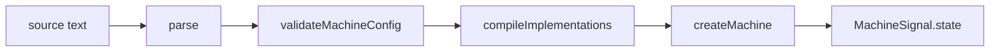

# @fozy-labs/statechart-viz

[](https://www.npmjs.com/package/@fozy-labs/statechart-viz)
[](../../LICENSE)

A React component that runs an [`@fozy-labs/rx-toolkit`](https://github.com/fozy-labs/rx-toolkit) statechart on top of
its own Mermaid diagram: active states are highlighted from the machine's `value`, transitions are clickable, and the
event log and `context` sit beside them.

```tsx
import { MachineSignal } from "@fozy-labs/rx-toolkit";
import { StatechartViz } from "@fozy-labs/statechart-viz";
import { definition } from "./square.generated";

const square$ = MachineSignal.state(definition);

<StatechartViz machine={square$} />;
```

`square.generated.ts` comes from the [converter](../converter/README.md), but nothing forces that: any machine whose
definition carries a `source` or can render itself through `toMermaid()` will do.

## Install

```sh
npm install @fozy-labs/statechart-viz @fozy-labs/rx-toolkit@rc mermaid react react-dom rxjs
```

| Peer | Range | Needed for |
| --- | --- | --- |
| `@fozy-labs/rx-toolkit` | `>=0.12.0-rc.1` | `Signal`, `MachineSignal`, `createMachine`, `mutate`; the floor is set by `mutate` and `definition.source` |
| `mermaid` | `^11.0.0` | rendering and indexing the diagram; loaded through `import()` on first use |
| `react`, `react-dom` | `^19.0.0` | the component itself |
| `rxjs` | `^7.0.0` | the `Observable` type on the machine interface — type-only, nothing imports it at runtime |

`svg-pan-zoom` and `@fozy-labs/statechart-converter` are ordinary dependencies and come with the package. The
converter is only reached through `import()` in [source mode](#source-mode); a host that builds for
`machine` mode alone never pulls it, nor the TypeScript compiler behind it.

Node `>=20.19.0` for the toolchain.

## Modes

| Mode | What is rendered | Where guard and action code comes from |
| --- | --- | --- |
| `machine` | `definition.source ?? definition.toMermaid()` | the machine definition — compiled TypeScript, no `eval` |
| `source` | the `.mmd` text, or the selected block of a Markdown document | `%% @…` directive bodies, compiled with `new Function` |

### Machine mode

```tsx
<StatechartViz machine={square$} title="Square" />;
```

The host owns the machine: the component subscribes to it and never disposes it. Passing a different `machine`
rebuilds the internal store, which resets the selection, the log and the payload editor.

### Source mode

```tsx
<StatechartViz source={mmdText} onMachine={(machine) => (window.machine = machine)} />;
```

The text is parsed, validated, compiled and started; the component owns the resulting machine and disposes it when
the text changes or the component unmounts. `onMachine` receives it, then `null` on teardown. Under React
`StrictMode` that cycle runs twice on mount.



`parse` and `validateMachineConfig` come from the [converter](../converter/README.md), which is also where the input
language is documented; `createMachine`, `mutate` and `MachineSignal` come from the library. `@context initial` is
passed as a factory, so every restart re-evaluates the expression.

A Markdown document works in place of a bare `.mmd`: when the text contains a fenced block, the pipeline runs on the
block declaring `%% @machine`, `machineId` picks which one (the first by default), and the diagram renders that same
block. Error lines are document coordinates, not block-relative.

Every stage failure lands in the notice area (`[data-scv-notice]`) naming the stage and the source line:

| Stage | Failure | Notice |
| --- | --- | --- |
| parse | the converter's `StatechartParseError` | `Parsing failed, line N[:col]: message[ (at path)]` |
| validate | the `createMachine` gate rejected the config | `Machine config error, line N: message[ (at path)]` |
| compile | a directive body is not valid JavaScript | `Compiling failed, line N: @kind name: message` |
| create | the library refused to build the machine | `Machine creation failed: message` |
| runtime | a directive body threw while the machine was running | `Runtime error: message`; the snapshot goes to `status: "error"` |

Programmatically, `createSourceMachine` rejects with `SourceMachineError`, carrying `stage`, an optional `line` and
the original `cause`.

> [!WARNING]
> An unknown `machineId` produces two errors at once: the notice reports the pipeline failure, while the diagram
> panel falls back to the whole document and shows a Mermaid parse error. The pipeline message is the real one.

## Interaction

**Active states** are projected from the machine's `value` onto flat Mermaid ids — `{ working: "green" }` lights up
both `working` and `green`. Region keys (`$0`, `$1`) address no node; `$final` maps to the `[*]` node per the table in
[docs/svg-scheme.md](docs/svg-scheme.md).

**Transitions** carry one of three statuses, recomputed on every snapshot:

| Status | Meaning | Appearance |
| --- | --- | --- |
| `enabled` | the machine accepts the event right now | green, clicking sends it |
| `blocked` | the machine refuses it, normally a guard | amber dashed; clicking logs the refusal with the guard names and flashes the edge |
| `inert` | everything else: the source state is not active, the label is not an event, or the payload is invalid | unchanged |

An invalid payload makes every edge inert rather than dimming them silently — the reason is shown next to the field
that caused it.

**Clicking a state** selects it and lists its outgoing events as buttons, ancestors included. One button per event
name, innermost definition winning; only `on` transitions produce buttons, never `after`, `always` or `onDone`. A
button the machine currently refuses shows the guard that stands in the way (`⊘ hasKey`) instead of just dimming.
With several guarded candidates the badge names the first of them, which is not necessarily the one that refused.

**The payload** is merged into the event: `{ "value": 12 }` sends `{ type: "SQUARE", value: 12 }`. The editor has two
modes behind a toggle — **Fields** (the default: key/value rows, each value read as JSON and kept as a string when it
does not parse) and **JSON** (the raw object). Switching converts the value when the mode being left parses;
unparsable JSON blocks the switch to Fields without losing the text. The payload must be a JSON object: arrays,
scalars and duplicate keys are rejected with a message under the field.

> [!WARNING]
> Do not name a payload key `type`. It collides with the event type, and the enabled/blocked status is computed from
> a different merge order than the one used to send.

**The log** holds the last 200 entries, newest first. An accepted event reads `HH:MM:SS.mmm EVENT from → to`, a
refused one `HH:MM:SS.mmm ⊘ EVENT [guard] from`. Timestamps are UTC time-of-day, with no date.

**The context panel** pretty-prints the machine's `context`, falling back to `String(value)` if it is cyclic.

Restarting the machine from a state picked on the diagram is not offered: the library has no API for starting a
machine at a given `value`.

## Props

```ts
type StatechartVizProps =
    | { machine: VizMachine; title?: string }
    | {
          source: string;
          machineId?: string;
          title?: string;
          onMachine?: (machine: DisposableVizMachine | null) => void;
      };

type StatechartVizRootProps = StatechartVizProps & {
    className?: string;
    style?: CSSProperties;
    unstyled?: boolean;
    children?: ReactNode;
};
```

`StatechartViz` and `StatechartViz.Root` both take `StatechartVizRootProps`.

#### `machine`

Type: `VizMachine`

A running machine. `VizMachine` is a structural subset of the library's `MachineStateSignal`, so
`MachineSignal.state(definition)` satisfies it without a cast — enforced by a type test in the package.

#### `source`

Type: `string`

A `.mmd` diagram, or a Markdown document containing one. Whether the text is treated as a document is decided by a
fence heuristic: a line starting with three backticks or tildes, indented by at most three spaces.

#### `machineId`

Type: `string`\
Default: the first machine of the document

Which `%% @machine` block to run. Only meaningful when `source` is a Markdown document.

#### `title`

Type: `string`\
Default: `definition.id`, or `"statechart"` while a `source` pipeline has not produced a machine yet

The heading of the component.

#### `onMachine`

Type: `(machine: DisposableVizMachine | null) => void`

Called with the machine the `source` pipeline produced, and with `null` when it is disposed.

#### `unstyled`

Type: `boolean`\
Default: `false`

Skips the built-in stylesheet. See [Theming](#theming).

#### `children`

Type: `ReactNode`

Replaces the default layout with your own arrangement of parts. See
[Composition](#composition-and-the-headless-api).

## Composition and the headless API

`<StatechartViz />` is `<StatechartViz.Root>` plus the default layout: a header, then a body holding the diagram and
a side column of notice, events, log and context. Pass `children` to arrange the parts yourself, or to drop your own
panel in among them.

```tsx
<StatechartViz.Root machine={square$}>
    <StatechartViz.Diagram>
        <StatechartViz.DiagramControls />
    </StatechartViz.Diagram>
    <MyInspector />
</StatechartViz.Root>
```

| Part | Renders |
| --- | --- |
| `Root` | the provider and the root element; the only part that takes props beyond `className` |
| `Header` | the title, the machine status and the formatted state value |
| `Body` | the two-column grid; takes `children` |
| `Diagram` | the diagram panel; `children` become an overlay on top of it |
| `DiagramControls` | zoom in / out / fit, as HTML positioned over the diagram |
| `Side` | the side column; takes `children` |
| `Notice` | the pipeline or runtime error of `source` mode |
| `Events` | the outgoing events of the selected state, with the payload editor |
| `PayloadEditor` | the payload editor on its own |
| `Log` | the event log |
| `Context` | the machine's `context` |

### `useStatechartViz()`

Returns `StatechartVizApi`. Throws when called outside a `Root`.

| Field | Type | What it is |
| --- | --- | --- |
| `machine` | `VizMachine \| null` | `null` in `source` mode until the pipeline resolves |
| `snapshot` | `VizSnapshot \| null` | the machine's current `status`, `value` and `context` |
| `title` | `string` | the resolved title |
| `notice` | `string \| null` | the pipeline or runtime error; always `null` in `machine` mode |
| `diagram` | `DiagramState` | `loading`, `ready` with the rendered SVG, or `error` |
| `activeIds` | `ReadonlySet<string>` | Mermaid ids of the active states |
| `edgeStatuses` | `ReadonlyMap<number, EdgeInteractivity>` | per-edge `enabled` / `blocked` / `inert` |
| `selectedId` | `string \| null` | the state the user clicked |
| `select` | `(id: string \| null) => void` | select or clear |
| `outgoing` | `OutgoingEvent[]` | events leaving the selected state, ancestors included |
| `canSend` | `(type: string) => boolean` | whether the machine would accept it with the current payload |
| `send` | `(type: string) => boolean` | sends and logs; a no-op returning `false` without a machine or with an invalid payload |
| `log` | `LogEntry[]` | newest first, capped at 200 |
| `clearLog` | `() => void` | no built-in part calls this — it exists for host UI |
| `payload` | `PayloadApi` | the editor's state, its parse result, and the mutators behind both modes |

### `useDiagramControls()`

Returns `{ zoomIn, zoomOut, reset }`, or `null` outside a `Diagram` and until the pan/zoom instance exists.

## Theming

Every colour is a CSS custom property on `.scv`; a host overrides the ones it cares about, dark themes included. The
table is also exported as `THEME_TOKENS`.

| Token | Default | Paints |
| --- | --- | --- |
| `--scv-bg` | `#fff` | the diagram field, inputs, buttons |
| `--scv-panel` | `#fafafa` | side panel backgrounds |
| `--scv-text` | `#222` | body text |
| `--scv-muted` | `#7a7a7a` | secondary text: panel titles, hints, log timestamps |
| `--scv-border` | `#d9d9d9` | panel and diagram borders |
| `--scv-border-strong` | `#b5b5b5` | borders of interactive controls |
| `--scv-active` | `#d0342c` | the outline of an active state |
| `--scv-active-fill` | `#fff0ee` | the fill of an active state |
| `--scv-selected` | `#1a6ee0` | the outline of the selected state |
| `--scv-enabled` | `#1f8a3b` | enabled transitions and their buttons |
| `--scv-blocked` | `#b45309` | guard-blocked transitions and guard badges |
| `--scv-error` | `#b00020` | error text |

Two layout variables sit outside `THEME_TOKENS`: `--scv-min-height` (default `480px`, the component's minimum) and
`--scv-diagram-min-height` (`420px`, the diagram panel's). A host short on vertical space sets both to `0` so the
component never outgrows its container. The side column is a fixed `320px` grid track and does not reflow.

`unstyled` on `Root` drops the built-in stylesheet — `BASE_CSS` is exported as a starting point — and leaves the
host to style the `scv-*` classes and `data-scv-*` attributes. The diagram's own interactivity rules (cursors, highlight
outlines) are injected either way: they are scoped to the id of that particular SVG and read the same tokens with
fallback values, so highlighting stays legible with no host styles at all. The inside of the SVG — Mermaid's own
theme — is configured through Mermaid by the host, not through these tokens.

Each mounted component injects its own copy of the stylesheet into its root element. There is no deduplication across
instances.

## Security: eval and CSP

`source` mode executes the diagram as code: the bodies of `@guard`, `@action`, `@delay` and `@context initial` are
compiled with `new Function`, in `src/playground/compileImplementations.ts` — the only `eval` site in the package.

- The host needs `script-src 'unsafe-eval'`. Under a strict CSP the mode does not work.
- Both modes inject `<style>` elements, so `style-src` must allow inline styles or supply a nonce.
- Someone else's `.mmd` is someone else's code. To display files you did not write, or to embed under a strict CSP,
  use `machine` mode with a definition produced by the converter.

The library core contains no `eval`.

## How it works

The diagram is rendered once through `mermaid.render`; its nodes and edges are then tagged with `data-scv-state`,
`data-scv-edge` and `data-scv-event` following [docs/svg-scheme.md](docs/svg-scheme.md). Each snapshot only toggles
classes — `scv-active`, `scv-selected`, `scv-enabled`, `scv-blocked` — with no re-render. `scv-denied` is the
one-shot flash on clicking a blocked edge.

The diagram panel watches its own size. Until the user zooms or pans, every resize refits the diagram into the panel;
after a manual zoom the viewport is preserved, and the fit button hands control back. Zoom buttons are an HTML
overlay rather than svg-pan-zoom's built-in icons, which are drawn into the SVG once at initialization and do not
follow the panel.

`mermaid.initialize` is never called — Mermaid's configuration stays with the host. Internal state is held in
rx-toolkit signals and read through `useSignal`.

## Limitations

- **`securityLevel: "sandbox"` is not supported.** Mermaid moves the SVG into an iframe and the component throws.
- **Only `stateDiagram-v2` sources.** Anything else is rejected while indexing the diagram.
- **Clickable events are limited to the label grammar** — `[A-Za-z_][A-Za-z0-9_]*`. Labels reading `after …`,
  `done`, nothing at all, or an event name containing `-` or `.` are inert.
- **Parallel regions are never highlighted.** Mermaid gives their clusters no stable id, and a region's final state
  has no node at all. See [docs/svg-scheme.md](docs/svg-scheme.md).
- **`machine` mode without `definition.source` relies on `toMermaid()`**, which derives node ids from state keys:
  characters outside `[A-Za-z0-9_]` become `_`, and a key repeated under different parents becomes the `_`-joined
  path, then a numeric suffix. Highlighting looks nodes up by the raw key, so those states never light up. Give
  states globally unique keys, or supply `source`.
- **The diagram has no keyboard affordance.** States and edges respond to clicks only and expose no accessible names.
- **The text is parsed twice per render** — once to index the graph, once to draw it — and the component depends on
  Mermaid internals (`getDiagramFromText`, `db.getData()`) to do the first.

## Also exported

Beyond the component, the hooks and the types above, the entry point re-exports the internals the playground and the
tests are built on. They are public but secondary: `createSourceMachine`, `SourceMachineError` and the rest of the
`source` pipeline (`compileImplementations`, `toMachineImplementations`, `looksLikeMarkdown`, `resolveDiagramSource`);
the payload helpers (`parsePayload`, `parseRowValue`, `buildRowsPayload`); the config walkers
(`collectOutgoingEvents`, `collectGuardsForEvent`, `findStateChain`, `normalizeTransitions`, `describeTarget`); the
state-value helpers (`collectActivePaths`, `formatStateValue`, `projectActiveIds`); `parseTransitionLabel`;
`computeEdgeStatuses`; and `diagramCss`.

The SVG-level helpers — annotation, highlight application, click resolution, the `data-scv-*` constants — are
deliberately **not** exported, even though [docs/svg-scheme.md](docs/svg-scheme.md) describes them. The stable
contract for a host is the attributes themselves.

## Development

Run these from the repository root, or build the converter first: this package consumes it through `workspace:^`,
as a symlink, and reads its `dist/`.

```sh
pnpm install                                  # at the repository root
pnpm --filter ./packages/converter run build  # unless you came through a root script

pnpm run dev                                  # playground on http://localhost:3100
pnpm run ts-check                             # against the converter's dist/ and the installed rx-toolkit
pnpm run test                                 # vitest in jsdom
pnpm run test:e2e                             # Playwright, chromium, against the playground
pnpm run lint
pnpm run format:check
pnpm run build                                # dist/index.js + dist/index.d.ts
```

The playground takes `?fixture=trafficLight|square|parallel|door`, plus `&mode=source`, `&source=<text>` and
`&machine=<id>`; the diagram text is editable in the field below the diagram. In `source` mode it runs the real
pipeline over the fixture text. `window.__scvPlayground.machine` holds the running machine. The rendering spike used
to derive the SVG scheme lives at `/spike/`.

Fixtures under `src/testing/fixtures/` are repository-internal and not part of the published package: `square` and
`trafficLight` are the proposal's examples verbatim, `door` carries a guard that refuses in the initial context, and
`parallel` exercises regions.

Unit tests cover the core helpers, the real `source` pipeline, the `VizMachine` type test, and file snapshots of
`src/__tests__/proposal/*.generated.ts` — the converter's output, refreshed with `vitest -u`.
