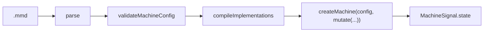

# @fozy-labs/statechart-viz

React-компонент `StatechartViz` — интерактивная визуализация statechart'а rx-toolkit поверх диаграммы
mermaid (`stateDiagram-v2`): подсветка активных состояний по `value` запущенной машины, отправка событий кликом
по переходу или кнопкой, лог событий и текущий `context`. Собирается Vite как библиотека (`dist/`); пакет
`packages/viz` репозитория [fozy-labs/statechart](../../README.md). Требует `@fozy-labs/rx-toolkit` `>=0.12.0-rc.1`
(peer-зависимость: `mutate`, `definition.source`).

## Содержание

- [Пропсы](#пропсы)
- [Режимы](#режимы)
- [Режим source](#режим-source)
- [Правило eval / CSP](#правило-eval--csp)
- [Как это работает](#как-это-работает)
- [Ограничения](#ограничения)
- [Разработка](#разработка)

## Пропсы

```ts
type StatechartVizProps =
    | { machine: VizMachine; title?: string } // режим machine
    | {
          // режим source
          source: string; // .mmd или markdown-документ с диаграммой в ```mermaid-блоке
          machineId?: string; // какую машину документа запускать; по умолчанию первую
          title?: string;
          onMachine?: (machine: DisposableVizMachine | null) => void;
      };
```

`VizMachine` — структурное подмножество `MachineStateSignal` библиотеки; `MachineSignal.state(definition)`
присваивается ему без приведений типов (`src/__tests__/vizMachine.types.test.tsx`):

```ts
interface VizMachine<TContext = unknown, TEvent extends { type: string } = { type: string }> {
    (): { status: string; value: StateValue; context: TContext };   // StateValue — тип библиотеки
    readonly obs: Observable<{ status: string; value: StateValue; context: TContext }>;
    readonly definition: { readonly id: string; readonly source?: string; readonly config: MachineConfigLike; toMermaid(): string };
    send(event: TEvent): void;
    can(event: TEvent): boolean;
    matches(value: StateValue): boolean;
}
```

`MachineConfigLike` — read-only и «свободно» типизированный вид конфига (`id`, `initial`, `states` опциональны;
`on`/`after`/`always`/`onDone` — строка, объект или массив с возможными `undefined`; guard/action — имя,
`{ type }` или функция). Обход конфига (`core/configWalk.ts`) нормализует записи и даёт guard'ам/action'ам
отображаемые имена: строка — как есть, функция — `name` или `anonymous` (встроенные `and()`, `assign()`,
`mutate()` названы по создателю), объект — `type`. Для тестов есть двойник `createFakeVizMachine` в
`src/testing/` поверх JSON-конфига конвертера.

`title` — заголовок панели; по умолчанию `definition.id`. `onMachine` (только режим `source`) получает созданную
машину и `null`, когда она удалена (смена текста, размонтирование).

## Режимы

| Режим     | Что рендерится                                  | Откуда код guards/actions                          |
|-----------|-------------------------------------------------|----------------------------------------------------|
| `machine` | `definition.source ?? definition.toMermaid()`   | из определения машины (сгенерированный TS), без eval |
| `source`  | текст `.mmd` или выбранный блок markdown-документа | тела директив `%% @…` компилируются через `new Function` |

Взаимодействие (общее для режимов):

- активные состояния подсвечены; `value` проецируется на плоские mermaid-id (`{ working: "green" }` →
  `working`, `green`); ключи регионов `$0`/`$1` пропускаются, `$final` отображается на узел `[*]` по таблице в
  [docs/svg-scheme.md](docs/svg-scheme.md#start-and-end-pseudo-states);
- клик по переходу (ребро или подпись) отправляет событие, если оно сейчас разрешено (`can`) и исходное
  состояние ребра активно; разрешённые рёбра выделены;
- клик по состоянию выделяет его и показывает кнопки исходящих событий (включая события предков);
  поле payload — JSON-объект, который подмешивается в событие (`{ "value": 12 }` → `{ type: "SQUARE", value: 12 }`);
- панели: диаграмма (pan/zoom), лог событий, `context`;
- телепорта (перезапуск машины из выбранного состояния по клику с модификатором) нет: у библиотеки нет API
  запуска машины из заданного `value`.

## Режим source

Конвейер `createSourceMachine(source)` (`src/playground/createSourceMachine.ts`):



`parse` и `validateMachineConfig` — из [конвертера](../converter/README.md) (там же грамматика и директивы);
`createMachine`, `mutate`, `MachineSignal` — из библиотеки. `@context initial` передаётся в `createMachine`
фабрикой: каждый экземпляр и каждый рестарт вычисляют выражение заново.

Markdown вместо `.mmd`: если в тексте есть ```` ```mermaid ````-блок с `%% @machine`, конвейер работает над
блоком — его же рендерит диаграмма (`resolveDiagramSource`), а `machineId` выбирает машину из документа
(по умолчанию первая; неизвестное имя — ошибка со списком доступных). Строки в уведомлениях — координаты
документа, не блока. Правила разбора блоков — в [конвертере](../converter/README.md#markdown-документ).

- Конвертер (и компилятор TypeScript, от которого он зависит) грузится `import()` при первом вызове — так же,
  как `mermaid`. Режим `machine` его не трогает: хост, собирающий viz только для него, парсер не получает.
- Машина живёт, пока живёт текст: компонент создаёт её в эффекте по `source` и вызывает `dispose()` при смене
  текста и размонтировании. Пока конвейер работает, панели пусты; результат — `onMachine`.
- Ошибка любого этапа — в области уведомления (`[data-scv-notice]`), с этапом и строкой источника:

| Этап       | Ошибка                                              | Текст уведомления                                  |
|------------|-----------------------------------------------------|----------------------------------------------------|
| parse      | `StatechartParseError` конвертера                   | `Parse error, line N[:col]: message[ (at path)]`   |
| validate   | `StatechartParseError` от `createMachine`-гейта     | `Machine config error, line N: message (at path)`  |
| compile    | `CompileError` (тело — не JavaScript)               | `Compile error, line N: @kind name: message`       |
| create     | `MachineConfigError` библиотеки                     | `Machine config error: message`                    |
| любой      | прочее                                              | `<Этап> failed: message`                           |
| runtime    | исключение тела при работе машины (`onError`)       | `Runtime error: message`; snapshot — `status: "error"` |

Программно: `createSourceMachine` отклоняет промис `SourceMachineError` (`stage`, `line?`, `cause`).

## Правило eval / CSP

Режим `source` исполняет текст схемы как код: тела `@guard`/`@action`/`@delay`/`@context initial` компилируются
`new Function` (единственное место eval в пакете — `src/playground/compileImplementations.ts`). Следствия:

- хосту нужен CSP с `unsafe-eval`; при строгом CSP режим не работает;
- чужой `.mmd` — это чужой код. Показ не своих файлов и встраивание в CSP-строгую страницу — только режим
  `machine` с кодом, полученным через конвертер.

Ядро библиотеки eval не содержит.

## Как это работает

- Диаграмма рендерится один раз (`mermaid.render`, `mermaid` — peer-зависимость, грузится `import()` по
  требованию); узлы и рёбра SVG размечаются атрибутами `data-scv-state` / `data-scv-edge` по схеме из
  [docs/svg-scheme.md](docs/svg-scheme.md); на каждый snapshot переключаются классы `scv-active`,
  `scv-selected`, `scv-enabled` без перерендера.
- `mermaid.initialize` компонент не вызывает — конфигурация mermaid остаётся за хостом; `securityLevel: "sandbox"`
  не поддерживается (SVG уезжает в iframe).
- Внутреннее состояние — на сигналах rx-toolkit (`Signal.state`), подписка через `useSignal`.
- Цвета настраиваются CSS-переменными `--scv-active`, `--scv-active-fill`, `--scv-selected`, `--scv-enabled`.

## Ограничения

- В режиме `machine` без `definition.source` диаграмма строится `toMermaid()`: id узлов выводятся из ключей
  состояний (символы вне `[A-Za-z0-9_]` заменяются на `_`; ключ, повторяющийся у разных родителей, становится
  путём через `_`), а подсветка ищет узел по ключу из `value` — такие состояния не подсвечиваются. Давайте
  состояниям глобально уникальные ключи-идентификаторы или передавайте `source`.
- Финальные состояния регионов не имеют узла — [docs/svg-scheme.md](docs/svg-scheme.md#start-and-end-pseudo-states).

## Разработка

```bash
npm install            # в корне репозитория; затем npm run build -w packages/converter: конвертер подключён
                       # workspace-ссылкой и читается из его dist/ (типы, unit-тесты, dev-сервер, сборка)
npm run dev            # playground: /?fixture=trafficLight|square|parallel[&mode=source[&source=<текст>][&machine=<id>]], спайк: /spike/
npm run ts-check       # против dist/ конвертера и установленного @fozy-labs/rx-toolkit
npm run test           # vitest (jsdom): core, playground (реальный конвейер), testing, type-тест VizMachine,
                       # файловые снапшоты src/__tests__/proposal/*.generated.ts — вывод конвертера (обновить: vitest -u)
npm run test:e2e       # Playwright (chromium) поверх playground'а
npm run lint / format:check
npm run build          # dist/index.js + dist/index.d.ts; конвертер и typescript — external
npm run check:all      # из корня репозитория npm run check:all собирает конвертер и проверяет оба пакета
```

Playground в режиме `source` гоняет реальный конвейер по тексту фикстуры (`src/testing/fixtures/*` — примеры
`square` и `trafficLight` из пропозала дословно) или по `?source=`; текст можно править в поле под диаграммой.
`window.__scvPlayground.machine` — запущенная машина (фейк или из `source`).
